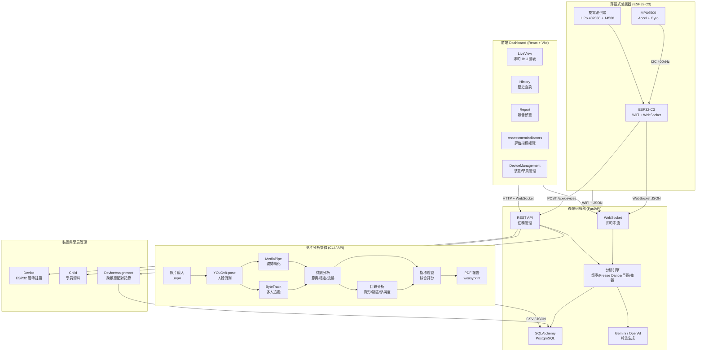
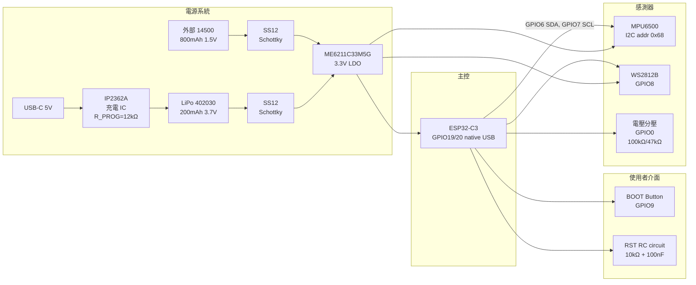
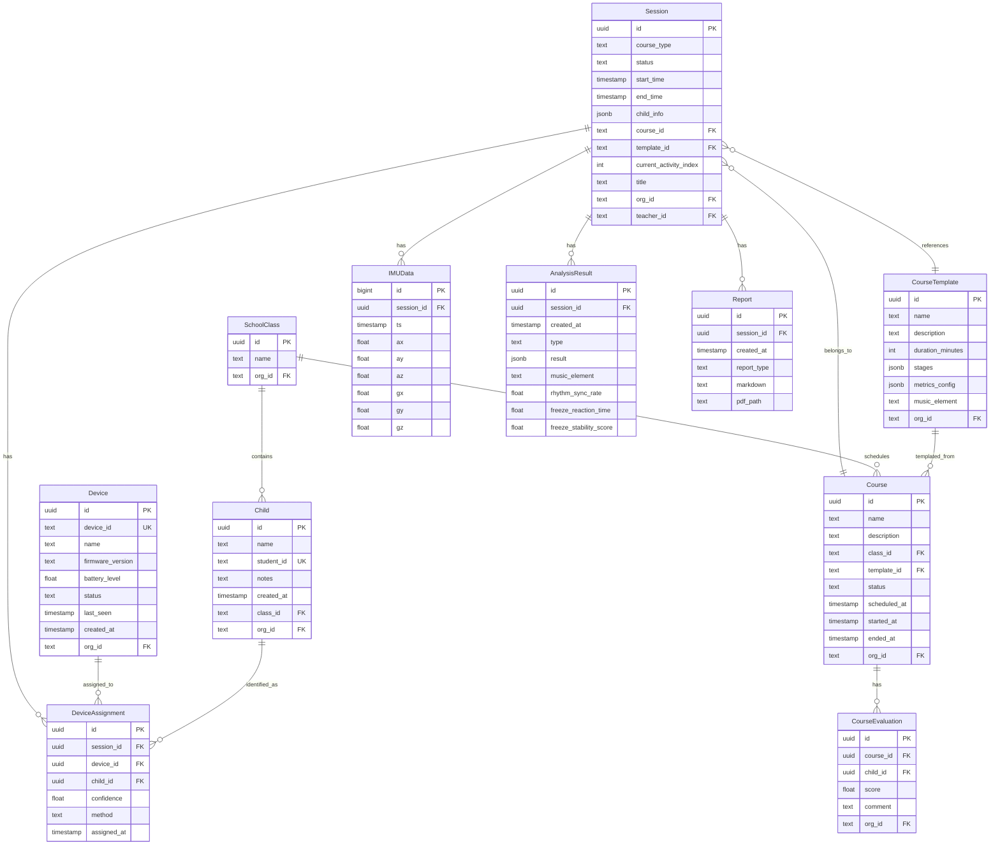
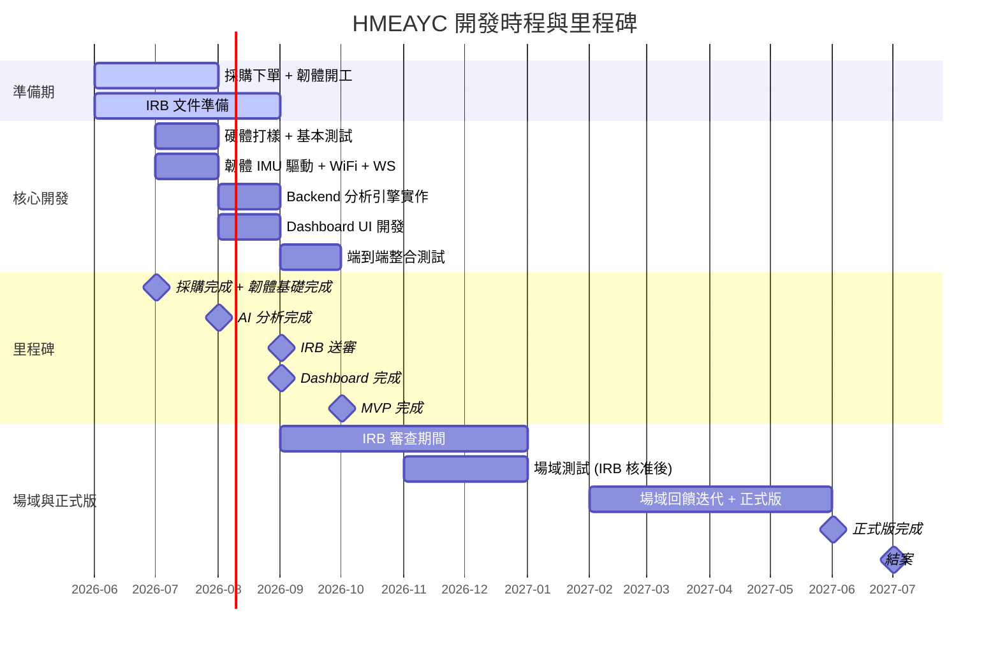
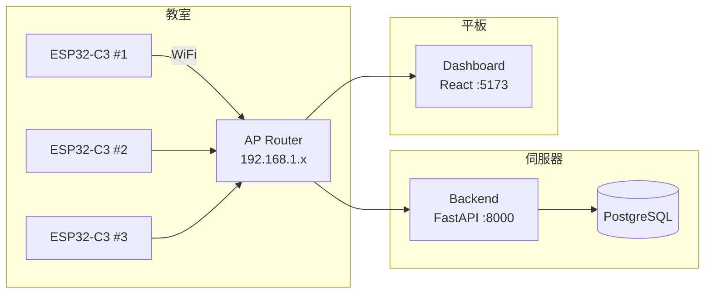

# HMEAYC 整體開發設計規劃書

> 即時 AI 音樂學習工具之研發、實作與成效評估：支持幼兒整合性發展
>
> Real-time AI Music Learning Tool: Development, Implementation, and Evaluation
> for Promoting Early Childhood Integrated Development

- **執行單位**：朝陽科技大學
- **計畫主持人**：李玲玉教授
- **技術路線**：A 方案（ESP32-C3 + MPU6500 IMU + Edge AI + Gemini）
- **執行期間**：2026/08/01 ～ 2027/07/31

---

## 目錄

1. [專案概述](#1-專案概述)
2. [系統架構](#2-系統架構)
3. [硬體設計](#3-硬體設計)
4. [韌體設計](#4-韌體設計)
5. [後端設計](#5-後端設計)
6. [前端設計](#6-前端設計)
7. [API 規範](#7-api-規範)
8. [資料庫 Schema](#8-資料庫-schema)
9. [分析演算法說明](#9-分析演算法說明)
10. [開發時程與里程碑](#10-開發時程與里程碑)
11. [部署規劃](#11-部署規劃)

---

## 1. 專案概述

### 1.1 專案目標

本專案旨在研發一套**即時 AI 音樂學習工具**，以 HMEAYC（幼兒音樂與動作整合性發展）核心理論為基礎，透過穿戴式 IMU 感測器、Edge AI 分析與大型語言模型（Gemini），實現對幼兒音樂律動活動的量化評估與自動化報告生成。

### 1.2 解決的問題

- 傳統幼兒音樂教學依賴教師主觀觀察，缺乏客觀量化數據
- 人工記錄與分析耗時費力，無法即時回饋
- 跨場域、跨時間的長期追蹤難以實現
- 家長溝通缺乏具體數據佐證

### 1.3 核心功能

| 功能 | 說明 |
|------|------|
| IMU 即時感測 | 穿戴式裝置蒐集幼兒肢體加速度與角速度（50Hz） |
| 節奏同步分析 | 計算幼兒動作與音樂節拍的對齊誤差 |
| Freeze Dance 分析 | 偵測音樂停止時的身體控制穩定性 |
| 群體巨觀分析 | 隊形分類、熱區分佈、參與度評估 |
| 身分辨識與追蹤 | 跨影片長期累積個別幼兒發展軌跡 |
| AI 教育報告 | Gemini / OpenAI 自動生成教學建議 |
| Dashboard 視覺化 | 即時圖表 + 歷史查詢 + 報告預覽 |
| **課程管理** | 教案模板 CRUD、課程排程、開始/結束、活動進度追蹤 |
| **裝置配對整合** | 課程進行中在課程頁面直接配對裝置給學童，綁定 session |
| **跨 session 趨勢** | 逐音樂元素彙整分析結果，提供幼兒長期發展趨勢圖 |

---

## 2. 系統架構

### 2.1 整體架構圖



### 2.2 Monorepo 目錄結構

```
HMEAYC/
├── .opencode/                   # opencode 設定與規劃
├── .gitignore
├── Makefile                     # 常用指令快捷
├── docker-compose.yml           # 整合開發環境
├── README.md
│
├── backend/                     # FastAPI 後端
│   ├── Dockerfile
│   ├── pyproject.toml
│   └── app/
│       ├── __init__.py          # 版本號
│       ├── __main__.py          # CLI entry
│       ├── main.py              # FastAPI app
│       ├── cli.py               # 命令列解析
│       ├── config.py            # 設定檔
│       ├── paths.py             # 目錄路徑管理
│       ├── pipeline.py          # 完整分析管線
│       ├── timecode.py          # 時間碼工具
│       ├── viz.py               # 圖表繪製
│       ├── api/                 # REST + WebSocket
│   │   ├── video_analysis.py    # 影片分析 API
│   │   ├── sessions.py      # Session API（含活動進度 + 評估計算）
│   │   ├── courses.py       # 課程 CRUD + 開始/結束自動管理 session
│   │   ├── devices.py       # 裝置/學員管理 + session 配對
│   │   ├── admin.py         # 班級 & 學童管理
│   │   └── ws.py            # IMU WebSocket
│       ├── analysis/            # 分析引擎
│       │   ├── macro.py         # 巨觀分析
│       │   ├── micro.py         # 微觀分析
│       │   ├── metrics.py       # 指標計算
│       │   ├── rhythm.py        # 節奏同步分析（IMU motion energy + beat matching）
│       │   ├── freeze_dance.py  # Freeze Dance 分析（reaction time + stability）
│       │   └── pose/            # 姿勢精化
│       │       ├── common.py
│       │       ├── estimator.py # MediaPipe Pose
│       │       └── holistic.py  # MediaPipe Holistic
│       ├── tracking/            # 身分辨識
│       │   ├── identity.py      # 外觀嵌入 + 身分庫
│       │   ├── face_insight.py  # HOG 特徵臉部嵌入（ lightweight fallback for ArcFace）
│       │   ├── longitudinal.py  # 跨影片累積
│       │   └── importer.py      # 批次匯入
│       ├── report/              # 報告生成
│       │   ├── advisor.py       # 教育建議模板
│       │   ├── ai_edu.py        # LLM 補充
│       │   ├── pdf.py           # PDF 輸出
│       │   └── student.py       # 個人長期報告
│       ├── ingest/              # 影片輸入
│       │   ├── video.py         # OpenCV + librosa
│       │   └── segment.py       # ffmpeg 裁切
│       ├── gemini/              # Gemini 整合
│       │   ├── client.py
│       │   └── prompts.py
│       ├── models/              # SQLAlchemy ORM
│       │   ├── session.py
│       │   ├── imu_data.py
│       │   ├── analysis_result.py
│       │   └── report.py
│       └── db/                  # DB 連線
│           ├── __init__.py
│           └── base.py
│
├── dashboard/                   # React 前端
│   ├── Dockerfile
│   ├── package.json
│   ├── vite.config.ts
│   ├── tsconfig.json
│   ├── tailwind.config.js
│   └── src/
│       ├── main.tsx
│       ├── App.tsx
│       ├── pages/
│       │   ├── LiveView.tsx     # 即時 IMU 圖表
│       │   ├── History.tsx      # 歷史紀錄
│       │   └── Report.tsx       # 報告檢視
│       ├── hooks/
│       │   └── useWebSocket.ts  # WebSocket Hook
│       └── api/
│           └── client.ts        # REST client
│
├── firmware/                    # ESP32-C3 韌體
│   ├── CMakeLists.txt
│   ├── Kconfig.projbuild
│   └── main/
│       ├── CMakeLists.txt
│       ├── main.c               # app_main
│       ├── imu_driver.c / .h    # MPU6500 I2C
│       ├── wifi_manager.c / .h  # WiFi + 重連
│       └── websocket_client.c / .h  # WS 上傳
│
├── hardware/                    # 硬體設計
│   ├── README.md                # 方塊圖 + BOM
│   ├── schematic.md             # 電路圖
│   └── pcb_layout.md            # PCB 佈局
│
├── field-testing/               # 場域測試（預留）
│
└── docs/                        # 文件
    └── agents/                  # Agent 說明文件
```

---

## 3. 硬體設計

### 3.1 系統方塊圖



### 3.2 電源設計

| 項目 | 規格 |
|------|------|
| 內部電池 | LiPo 402030 200mAh 3.7V |
| 外部電池 | 14500 800mAh 1.5V（裝入擴充座） |
| 充電 IC | IP2362A（R_PROG=12kΩ ⇒ ~100mA） |
| 二極體 OR-ing | SS12 Schottky（D1/D2），自動選擇電壓較高者 |
| LDO | ME6211C33M5G，dropout ~200mV@100mA |
| 可運作電壓範圍 | 4.2V ~ 3.35V（約 80% 電量） |
| 續航估算 | 內部電池：~1.5h；外部 14500：~6h |

### 3.3 接腳分配

| GPIO | 功能 | 備註 |
|------|------|------|
| GPIO6 | I2C SDA | MPU6500 data line |
| GPIO7 | I2C SCL | MPU6500 clock line (400kHz) |
| GPIO0 | ADC | 電池電壓分壓（100kΩ/47kΩ） |
| GPIO8 | WS2812B | NeoPixel 狀態指示燈 |
| GPIO9 | BOOT Button | 啟動模式選擇 + 使用者輸入 |
| GPIO19 | USB D- | Native USB |
| GPIO20 | USB D+ | Native USB |
| EN | RST RC | 10kΩ pull-up + 100nF to GND |

### 3.4 PCB 規格

| 項目 | 規格 |
|------|------|
| 尺寸 | 45mm × 35mm |
| 層數 | 2 層 |
| 最小線寬/線距 | 6mil / 6mil |
| 銅厚 | 1oz |
| 表面處理 | HASL (無鉛) |
| 特殊要求 | 天線禁制區、Via stitching 接地 |
| 預計打樣廠 | JLCPCB / PCBWay |

### 3.5 BOM 估算

| 零件 | 單價 (NTD) | 數量 | 小計 |
|------|-----------|------|------|
| ESP32-C3-MINI-1 模組 | 150 | 1 | 150 |
| MPU6500 | 35 | 1 | 35 |
| IP2362A + 被動元件 | 25 | 1 | 25 |
| ME6211C33M5G | 8 | 1 | 8 |
| SS12 Schottky | 3 | 2 | 6 |
| 402030 200mAh LiPo | 90 | 1 | 90 |
| USB-C 母座 | 8 | 1 | 8 |
| WS2812B | 15 | 1 | 15 |
| 電阻電容 (0402) | 0.5 | ~20 | 10 |
| PCB 打樣 (10pcs 分攤) | 60 | 1 | 60 |
| 其他（按鍵、排針等） | 30 | 1 | 30 |
| **單片合計** | | | **~437** |
| **10 片合計** | | | **~4,370** |

---

## 4. 韌體設計

### 4.1 技術棧

- **框架**：ESP-IDF v5.x（官方 ESP32-C3 支援）
- **語言**：C11
- **建置系統**：CMake + idf.py

### 4.2 專案結構

```
firmware/
├── CMakeLists.txt           # 頂層 CMake
├── Kconfig.projbuild        # 選單式設定（SSID/Password/URI/OTA/API）
├── partitions.csv           # 分割表（AB OTA 分割區）
├── sdkconfig.defaults       # 預設 IDF 設定
├── sdkconfig                # 實際 IDF 設定（自動產生）
├── dependencies.lock        # 元件相依鎖定
├── managed_components/      # ESP Registry 元件（esp_websocket_client, led_strip）
└── main/
    ├── CMakeLists.txt       # 元件 CMake
    ├── main.c               # app_main：初始化 + 主迴圈（WiFi→WS→IMU→OTA）
    ├── imu_driver.c /.h     # MPU6500 I2C 驅動
    ├── wifi_manager.c /.h   # WiFi 事件處理 + 自動重連
    ├── websocket_client.c /.h # WebSocket 上傳
    ├── wifi_config_nvs.c /.h  # NVS 遠端 WiFi 設定管理
    ├── device_registry.c /.h  # 裝置註冊（POST /api/devices）
    ├── battery.c /.h          # 電池電量 ADC 讀取
    ├── led_status.c /.h       # WS2812B NeoPixel 狀態燈
    └── ota_client.c /.h       # OTA 更新（版本檢查、下載、ack）
```

### 4.3 MPU6500 驅動

**初始化序列（`mpu6050_init`）：**

1. 喚醒：寫 `0x00` 到 `PWR_MGMT_1` (0x6B)
2. 等待 100ms 歸位
3. 設定 DLPF：寫 `0x03` 到 `CONFIG` (0x1A) ⇒ 44Hz 低通
4. 設定取樣率：寫 `19` 到 `SMPLRT_DIV` (0x19) ⇒ 1000 / (1+19) = 50Hz
5. 設定陀螺儀 ±250dps：寫 `0x00` 到 `GYRO_CONFIG` (0x1B)
6. 設定加速度 ±2g：寫 `0x00` 到 `ACCEL_CONFIG` (0x1C)

**資料讀取（`mpu6050_read_all`）：**

- Burst read 14 bytes from `ACCEL_XOUT_H` (0x3B)
- Big-endian 解析：ax, ay, az, temp, gx, gy, gz
- 縮放因數：accel 16384 LSB/g, gyro 131 LSB/dps

**定時器：**

- ESP 定時器 20ms 週期（50Hz）
- 每個 tick：讀取 IMU → 格式化 JSON → WebSocket 發送

### 4.4 WiFi 管理

- 使用 `esp_event_handler` 監聽 `WIFI_EVENT` / `IP_EVENT`
- 連線成功 → 啟動 WebSocket
- 斷線（`WIFI_EVENT_STA_DISCONNECTED`）→ 自動重連（`esp_wifi_connect()`）
- SSID / Password / WebSocket URI 透過 Kconfig / menuconfig 設定

### 4.5 WebSocket 用戶端

- 使用 ESP-IDF `esp_websocket_client`
- JSON 格式上傳：

```json
{
  "device_id": "HMEAYC-001",
  "ts": 1234567890.123,
  "ax": 0.12, "ay": -0.05, "az": 1.02,
  "gx": 0.5, "gy": -1.2, "gz": 0.3
}
```

- 發送間隔：50Hz（每 20ms 一筆）
- 斷線重連：WiFi 恢復後自動重建 WebSocket 連線

### 4.6 Kconfig 參數

| 參數 | 預設值 | 說明 |
|------|--------|------|
| `HMEAYC_DEVICE_ID` | `hmeayc-001` | 裝置識別碼 |
| `HMEAYC_FIRMWARE_VERSION` | `1.0.0` | 韌體版本號（semver） |
| `HMEAYC_WIFI_SSID` | `HMEAYC` | WiFi SSID |
| `HMEAYC_WIFI_PASSWORD` | — | WiFi 密碼 |
| `HMEAYC_WS_URI` | `ws://192.168.1.105:8000/ws/default` | WebSocket URI |
| `HMEAYC_SAMPLE_RATE_HZ` | `50` | IMU 取樣頻率（5–200 Hz 可調） |
| `HMEAYC_API_BASE_URL` | `http://192.168.1.105:8000/api` | REST API 基礎 URL |
| `HMEAYC_OTA_BASE_URL` | `http://192.168.1.105:8000/api/firmware` | OTA 伺服器 URL |

---

## 5. 後端設計

### 5.1 技術棧

| 組件 | 技術 | 說明 |
|------|------|------|
| Web Framework | FastAPI 0.115+ | REST + WebSocket |
| ASGI Server | Uvicorn 0.30+ | 生產級 ASGI |
| ORM | SQLAlchemy 2.0+ | 非同步 ORM |
| Driver | asyncpg 0.30+ | PostgreSQL 非同步驅動 |
| Migration | Alembic 1.13+ | Schema 版本控制 |
| AI | google-genai | Gemini API |
| AI (備用) | openai | OpenAI-compatible API |

### 5.2 應用模組

```
backend/app/
├── main.py                 # FastAPI app 啟動 + 路由掛載
├── config.py               # Pydantic Settings
├── paths.py                # 資料目錄管理
├── pipeline.py             # 完整分析管線（orchestrator）
├── cli.py                  # 命令列介面
├── music.py                # 音樂分析工具（BPM/beat/stop detection）
├── viz.py                  # matploblib 圖表
├── timecode.py             # 時間碼工具
│
├── api/
│   ├── video_analysis.py   # POST /api/analyze/analyze
│   │                       # GET /api/analyze/tasks/{id}
│   │                       # GET /api/analyze/tasks
│   │                       # POST /api/analyze/tasks/{id}/cancel
│   ├── sessions.py         # Session CRUD API + 活動進度 + 評估計算 + 趨勢
│   ├── courses.py          # 課程 CRUD + 開始/結束 + 班級評分
│   ├── devices.py          # 裝置註冊 + 學員管理 + session 配對
│   ├── admin.py            # 班級管理 + 登入驗證
│   └── ws.py               # WebSocket /ws (IMU 即時流)
│
├── analysis/
│   ├── rhythm.py           # 節奏同步分析（已實作）
│   ├── freeze_dance.py     # Freeze Dance 分析（已實作）
│   ├── realtime.py         # 即時分析管線（RealtimeAnalyzer，整合 WS IMU 流）
│   ├── macro.py            # 巨觀：隊形、熱區、參與度
│   ├── micro.py            # 微觀：同步誤差、穩定度、jerk
│   ├── metrics.py          # 指標燈號：綠/黃/紅
│   ├── realtime.py         # 即時音樂分析管線（IMU 緩衝區 + 即時節奏/凍結）
│   └── pose/
│       ├── estimator.py    # MediaPipe Pose 精化
│       ├── holistic.py     # MediaPipe Holistic 精化
│       └── common.py       # COCO17 轉換共用
│
├── tracking/
│   ├── identity.py         # 外觀嵌入（HSV histogram）+ 身分庫
│   ├── face_insight.py     # HOG 特徵臉部嵌入（ lightweight fallback，待整合 insightface）
│   ├── longitudinal.py     # JSONL 跨影片累積
│   └── importer.py         # 批次匯入既有 metrics
│
├── report/
│   ├── advisor.py          # 教育建議 Markdown 模板
│   ├── ai_edu.py           # LLM 補充段落
│   ├── pdf.py              # Markdown → PDF (weasyprint)
│   └── student.py          # 個人長期趨勢報告
│
├── ingest/
│   ├── video.py            # OpenCV 中繼資料 + librosa 音訊
│   └── segment.py          # ffmpeg 影片裁切
│
├── gemini/
│   ├── client.py           # Google GenAI 客戶端
│   └── prompts.py          # Prompt 模板
│
├── models/
│   ├── session.py          # Session ORM
│   ├── imu_data.py         # IMUData ORM
│   ├── analysis_result.py  # AnalysisResult ORM
│   └── report.py           # Report ORM
│
└── db/
    ├── __init__.py
    └── base.py             # 引擎 + SessionLocal
```

### 5.3 分析管線流程（pipeline.py）

```
run_full_pipeline(video_path, ...)
  │
  ├─ read_video_meta()           # OpenCV metadata
  ├─ [t0/t1] → export_video_segment()  # ffmpeg 裁切（選用）
  ├─ _identity_pass()            # 片中點身分推測
  ├─ macro_analytics.run_macro() # 巨觀分析
  │   ├─ YOLO 逐幀偵測
  │   ├─ 隊形分類（scatter/circle/line/cluster）
  │   ├─ 熱區 3×3 網格
  │   └─ 參與度（位移活躍比例）
  ├─ load_audio_mono()           # librosa 音訊
  ├─ micro_analytics.run_micro() # 微觀分析
  │   ├─ Beat tracking + stop signal detection
  │   ├─ YOLO + ByteTrack 多人追蹤
  │   ├─ MediaPipe 姿勢精化（選用）
  │   ├─ 節奏同步誤差（手腕拍點對齊）
  │   ├─ 停止信號位移（穩定度）
  │   └─ 髖部軌跡 jerk（流暢度代理）
  ├─ _merge_child_identities()   # 身分對齊
  ├─ metrics_checker.run_metrics()  # 燈號評分
  ├─ advisor.render_edu_markdown()  # 教育報告
  ├─ ai_edu.augment_edu_report()    # LLM 補充（選用）
  ├─ [--pdf] → export_markdown_pdf()
  └─ longitudinal.append_session()  # 跨影片累積
```

---

## 6. 前端設計

### 6.1 技術棧

| 組件 | 技術 |
|------|------|
| 框架 | React 18+ |
| 建置 | Vite 5+ |
| 語言 | TypeScript 5+ |
| 樣式 | Tailwind CSS 3+ |
| 圖表 | Recharts |
| WebSocket | 原生 WebSocket API |
| HTTP | fetch / axios |

### 6.2 頁面結構

```
dashboard/src/
├── main.tsx                # ReactDOM.createRoot
├── App.tsx                 # 路由 + 佈局
├── index.css               # Tailwind 匯入
│
├── pages/
│   ├── Landing.tsx              # 首頁導航（6 張卡片）
│   ├── LiveView.tsx             # 即時 IMU 曲線（Recharts）+ 活動進度追蹤
│   ├── History.tsx              # 歷史 Session 列表 + 查詢
│   ├── Report.tsx               # 報告 Markdown/PDF 預覽
│   ├── AssessmentIndicators.tsx # 評估指標總覽（IMU/CV 即時運算）
│   ├── DeviceManagement.tsx     # 裝置/學員管理與跨模態配對
│   ├── Courses.tsx              # 課程列表 + 建立（自動命名）
│   ├── CourseDetail.tsx         # 課程詳情 + 開始/結束 + 裝置配對 + 評分
│   ├── ChildAssessments.tsx     # 幼兒跨 session 分析趨勢圖
│   └── Login.tsx                # 登入頁
│
├── hooks/
│   ├── useWebSocket.ts     # WS 連線管理 + 自動重連
│   └── useLiveMetrics.ts   # 即時 IMU 指標計算（jerk/activity/stability）
│
├── api/
│   └── client.ts           # REST API 封裝（sessions + devices + children）
│
├── components/
│   ├── ErrorBoundary.tsx   # 錯誤邊界
│   ├── LoadingSpinner.tsx  # 載入動畫
│   └── BeatIndicator.tsx   # BPM 脈衝指示器 + 節拍同步進度條
│
└── types/
    └── index.ts            # TypeScript 型別定義
```

### 6.3 路由設計

| 路徑 | 頁面 | 說明 |
|------|------|------|
| `/dashboard/` | Landing | 首頁導航 |
| `/dashboard/live/:sessionId` | LiveView | 即時 IMU 儀表板 + 活動進度 |
| `/dashboard/history` | History | 歷史 Session 列表 |
| `/dashboard/report/:sessionId` | Report | 單筆報告檢視 |
| `/dashboard/assessment/:sessionId` | AssessmentIndicators | 評估指標總覽 |
| `/dashboard/devices` | DeviceManagement | 裝置與學員管理 |
| `/dashboard/courses` | Courses | 課程列表 + 建立 |
| `/dashboard/courses/:id` | CourseDetail | 課程詳情 + 開始/結束 + 裝置配對 + 評分 |
| `/dashboard/courses/:id/report` | Report | 課程報告 |
| `/dashboard/children/:id/assessments` | ChildAssessments | 幼兒跨 session 分析趨勢 |

### 6.4 WebSocket Hook 設計

```typescript
// useWebSocket.ts 核心行為
- 連線：new WebSocket(ws://host:port/ws)
- 自動重連：斷線後 exponential backoff（1s, 2s, 4s, ..., max 30s）
- 訊息型別分派：
  - "imu"       → IMUChart 更新
  - "analysis"  → 分析結果更新
  - "status"    → 連線/分析狀態
- 清理：unmount 時 close()

// Vite proxy: /ws → ws://backend:8000/ws
```

---

## 7. API 規範

### 7.1 RESTful Endpoints

| Method | Path | Description | Auth |
|--------|------|-------------|------|
| `GET` | `/health` | 健康檢查 | — |
| `POST` | `/api/analyze/analyze` | 提交影片分析任務 | `X-API-Key` |
| `GET` | `/api/analyze/tasks` | 列出歷史任務 | `X-API-Key` |
| `GET` | `/api/analyze/tasks/{id}` | 查詢單一任務狀態 | `X-API-Key` |
| `POST` | `/api/analyze/tasks/{id}/cancel` | 取消任務 | `X-API-Key` |
| `GET` | `/api/sessions` | 列出 Session | — |
| `POST` | `/api/sessions` | 建立新 Session | — |
| `GET` | `/api/sessions/{id}` | 單一 Session 詳情 | — |
| `GET` | `/api/sessions/{id}/analysis` | Session 分析結果 | — |
| `POST` | `/api/sessions/{id}/report` | 產生報告 | — |
| `GET` | `/api/sessions/{id}/report` | Session 報告 | — |
| `GET` | `/api/reports/{id}` | 單一報告 | — |
| `GET` | `/api/devices` | 列出所有裝置 | — |
| `POST` | `/api/devices` | 註冊/更新裝置 | — |
| `GET` | `/api/children` | 列出所有學員 | — |
| `POST` | `/api/children` | 註冊學員 | — |
| `GET` | `/api/sessions/{id}/assignments` | 查詢配對結果 | — |
| `POST` | `/api/sessions/{id}/assign` | 執行裝置-學員配對 | — |
| `DELETE` | `/api/assignments/{id}` | 刪除配對 | — |
| `PUT` | `/api/children/{id}/assign` | 手動指定學員裝置（auto session） | — |
| `DELETE` | `/api/sessions/{id}` | 刪除 Session | `X-API-Key` |
| `GET` | `/api/templates` | 教案模板列表 | — |
| `POST` | `/api/templates` | 新增模板 | — |
| `GET` | `/api/templates/{id}` | 模板詳情 | — |
| `PUT` | `/api/templates/{id}` | 更新模板 | — |
| `DELETE` | `/api/templates/{id}` | 刪除模板 | — |
| `GET` | `/api/courses` | 課程列表 | — |
| `POST` | `/api/courses` | 建立課程 | — |
| `GET` | `/api/courses/{id}` | 課程詳情（含 session、active_session_id） | — |
| `PUT` | `/api/courses/{id}` | 更新課程 | — |
| `DELETE` | `/api/courses/{id}` | 刪除課程 | — |
| `POST` | `/api/courses/{id}/start` | 開始上課（自動建立 session） | teacher+ |
| `POST` | `/api/courses/{id}/end` | 結束課程（自動結束 session） | teacher+ |
| `GET` | `/api/courses/{id}/sessions` | 課程的 session 列表 | — |
| `GET` | `/api/courses/{id}/evaluations` | 課程評分列表 | teacher+ |
| `PUT` | `/api/courses/{id}/evaluations/{childId}` | 儲存學童評分 | teacher+ |
| `GET` | `/api/courses/{id}/report` | 課程報告 | — |
| `PUT` | `/api/sessions/{id}/activity` | 更新活動進度 | teacher+ |
| `POST` | `/api/sessions/{id}/music` | 上傳音樂檔或設定 BPM | teacher+ |
| `DELETE` | `/api/sessions/{id}/music` | 移除音樂設定 | teacher+ |
| `GET` | `/api/classes/{id}/children` | 班級學童列表 | teacher+ |
| `GET` | `/api/children/{id}/assessments` | 幼兒跨 session 評估 | — |
| `GET` | `/api/children/{id}/analysis/trends` | 幼兒分析趨勢（逐音樂元素） | — |
| `GET` | `/api/classes/{id}/assessments` | 班級評估彙整 | — |
| `POST` | `/api/sessions/{id}/assessments/compute` | 計算 session 評估指標 | — |

### 7.2 WebSocket 協定（`/ws`）

**用戶端 → 伺服器（IMU 資料）：**

```json
{
  "type": "imu",
  "device_id": "HMEAYC-001",
  "ts": 1234567890.123,
  "ax": 0.12, "ay": -0.05, "az": 1.02,
  "gx": 0.5, "gy": -1.2, "gz": 0.3
}
```

**伺服器 → 用戶端（分析結果）：**

```json
{
  "type": "analysis",
  "session_id": "uuid",
  "timestamp": 1234567890.123,
  "rhythm_sync": { "ms": 45, "rating": "excellent" },
  "stability": { "cm": 3.2, "rating": "excellent" }
}
```

**伺服器 → 用戶端（音樂資訊，Session 開始時廣播）：**

```json
{
  "type": "music",
  "bpm": 120.0,
  "beat_times": [0.5, 1.0, 1.5, 2.0, ...],
  "stop_times": [8.2, 15.7, ...],
  "duration": 180.5,
  "music_element": "節奏（Rhythm）"
}
```

**伺服器 → 用戶端（即時節奏更新，每 5 秒）：**

```json
{
  "type": "rhythm_update",
  "rhythm_sync_rate": 0.82,
  "bpm": 120.0,
  "peak_count": 45,
  "beat_count": 50
}
```

**伺服器 → 用戶端（凍結偵測更新，stop_time 觸發時）：**

```json
{
  "type": "freeze_update",
  "reaction_time": 0.35,
  "stability_score": 0.88
}
```

### 7.3 影片分析請求（POST `/api/analyze/analyze`）

```json
{
  "video_path": "/data/videos/session-001.mp4",
  "model": "yolov8n-pose.pt",
  "stride": 4,
  "pose": "pose",
  "learn_identities": false,
  "no_track": false,
  "t0": "00:30",
  "t1": "02:30",
  "no_ai": false,
  "pdf": false
}
```

**回應：**

```json
{
  "ok": true,
  "task_id": "a1b2c3d4e5f6...",
  "status": "queued"
}
```

---

## 8. 資料庫 Schema

### 8.1 ER 圖



### 8.2 Table 定義

**Course：**

| Column | Type | Constraints | Description |
|--------|------|------------|-------------|
| id | VARCHAR(36) | PK | UUID |
| org_id | VARCHAR(36) | FK→orgs.id | 所屬組織 |
| class_id | VARCHAR(36) | FK→classes.id | 關聯班級 |
| template_id | VARCHAR(36) | FK→course_templates.id | 關聯教案模板 |
| name | VARCHAR(200) | NOT NULL | 課程名稱（自動產生） |
| description | TEXT | — | 描述 |
| status | VARCHAR(20) | default 'draft' | draft/scheduled/active/completed/cancelled |
| scheduled_at | TIMESTAMPTZ | — | 排程時間 |
| started_at | TIMESTAMPTZ | — | 實際開始時間 |
| ended_at | TIMESTAMPTZ | — | 實際結束時間 |
| created_at | TIMESTAMPTZ | default now() | 建立時間 |

**CourseTemplate：**

| Column | Type | Constraints | Description |
|--------|------|------------|-------------|
| id | VARCHAR(36) | PK | UUID |
| org_id | VARCHAR(36) | FK→orgs.id | 所屬組織 |
| name | VARCHAR(200) | NOT NULL | 模板名稱 |
| description | TEXT | — | 描述 |
| duration_minutes | INTEGER | — | 預計分鐘數 |
| stages | JSONB | — | 活動階段陣列 `[{name, duration, type, ...}]` |
| metrics_config | JSONB | — | 指標開關設定 |
| music_element | VARCHAR(100) | — | 音樂元素（節奏/拍子/走停等） |
| created_at | TIMESTAMPTZ | default now() | 建立時間 |

**SchoolClass：**

| Column | Type | Constraints | Description |
|--------|------|------------|-------------|
| id | VARCHAR(36) | PK | UUID |
| org_id | VARCHAR(36) | FK→orgs.id | 所屬組織 |
| name | VARCHAR(200) | NOT NULL | 班級名稱 |
| created_at | TIMESTAMPTZ | default now() | 建立時間 |

**CourseEvaluation：**

| Column | Type | Constraints | Description |
|--------|------|------------|-------------|
| id | VARCHAR(36) | PK | UUID |
| course_id | VARCHAR(36) | FK→courses.id | 所屬課程 |
| child_id | VARCHAR(36) | FK→children.id | 學童 |
| score | FLOAT | — | 評分 0-100 |
| comment | TEXT | — | 評語 |
| org_id | VARCHAR(36) | FK→orgs.id | 所屬組織 |

**Session：**

| Column | Type | Constraints | Description |
|--------|------|------------|-------------|
| id | VARCHAR(36) | PK | UUID |
| course_type | ENUM | NOT NULL | march / car |
| child_info | JSONB | — | 學員補充資訊 |
| status | ENUM | default 'active' | active / completed |
| start_time | TIMESTAMPTZ | default now() | 開始時間 |
| end_time | TIMESTAMPTZ | — | 結束時間 |
| course_id | VARCHAR(36) | FK→courses.id | 所屬課程（開始上課時自動建立） |
| template_id | VARCHAR(36) | FK→course_templates.id | 關聯教案模板 |
| current_activity_index | INTEGER | default 0 | 當前活動進度索引 |
| title | VARCHAR(200) | — | 標題 |
| teacher_id | VARCHAR(36) | FK→users.id | 教師 |
| org_id | VARCHAR(36) | FK→orgs.id | 所屬組織 |

**Device：**

| Column | Type | Constraints | Description |
|--------|------|------------|-------------|
| id | VARCHAR(36) | PK | UUID |
| device_id | VARCHAR(50) | UNIQUE, NOT NULL, INDEX | ESP32-C3 實體 ID |
| name | VARCHAR(100) | — | 顯示名稱（如「腰帶 A」） |
| firmware_version | VARCHAR(32) | — | 目前韌體版本 |
| battery_level | FLOAT | — | 0.0 ~ 1.0 |
| status | ENUM | default 'offline' | online / offline |
| last_seen | TIMESTAMPTZ | — | 最後心跳時間 |
| created_at | TIMESTAMPTZ | default now() | 註冊時間 |

**Child：**

| Column | Type | Constraints | Description |
|--------|------|------------|-------------|
| id | VARCHAR(36) | PK | UUID |
| org_id | VARCHAR(36) | FK→orgs.id | 所屬組織 |
| name | VARCHAR(100) | NOT NULL | 幼兒姓名 |
| student_id | VARCHAR(50) | UNIQUE | 學號 |
| notes | TEXT | — | 備註 |
| class_id | VARCHAR(36) | FK→classes.id | 所屬班級 |
| added_by | VARCHAR(36) | FK→users.id | 建立者 |
| created_at | TIMESTAMPTZ | default now() | 建立時間 |

**DeviceAssignment：**

| Column | Type | Constraints | Description |
|--------|------|------------|-------------|
| id | VARCHAR(36) | PK | UUID |
| session_id | VARCHAR(36) | FK → Session.id, NOT NULL | 所屬課程 |
| device_id | VARCHAR(36) | FK → Device.id, NOT NULL | 配對裝置 |
| child_id | VARCHAR(36) | FK → Child.id, NOT NULL | 配對學員 |
| confidence | FLOAT | — | 配對信心度 [0, 1] |
| method | VARCHAR(32) | default 'manual' | manual / cross_modal_fft |
| assigned_at | TIMESTAMPTZ | default now() | 配對時間 |

Unique: `(session_id, device_id)` — 同一課程中裝置不重複配對

### 8.3 課程管理資料流

```
建立課程 (draft)
  │
  ├─ 選擇班級 + 教案模板
  │   課程名稱自動產生：{日期} {班級} {模板名稱}
  │
  ├─ 開始上課 → 課程狀態 active
  │   └─ 自動建立 Session（course_id, template_id, status=active）
  │       └─ 顯示「裝置配對」區塊
  │           └─ 每個學童配對一個 ESP32 腰帶（POST /api/sessions/{id}/assign）
  │
  ├─ 即時串流期間
  │   ├─ ESP32 腰帶以 50Hz WebSocket 上傳 IMU
  │   ├─ LiveView 即時圖表監控
  │   ├─ 活動進度追蹤（PUT /api/sessions/{id}/activity）
  │   └─ 評估指標計算（POST /api/sessions/{id}/assessments/compute）
  │
  ├─ 結束課程 → 課程狀態 completed
  │   └─ 自動結束該課程所有 active Session
  │       ├─ 裝置配對區塊隱藏
  │       └─ 顯示「學生評分」區塊
  │           └─ 教師對每個學童打分數 + 評語
  │
  └─ 查看報告
      ├─ 課程報告（sessions 彙整 + 評分）
      └─ 跨 session 趨勢（逐音樂元素彙整分析結果）
```

**Session 的生命週期：**
- Session 由「開始上課」自動建立，由「結束課程」自動關閉
- 一個課程可以有多個 Session（同一天有多段活動）
- DeviceAssignment 綁定在 Session 層級（一個裝置在同一 Session 只配對一個學童）
- AnalysisResult 可跨 Session 依 music_element 分組追蹤趨勢

**IMUData：**

| Column | Type | Constraints | Description |
|--------|------|------------|-------------|
| id | BIGSERIAL | PK | 遞增 ID |
| session_id | UUID | FK → Session.id, NOT NULL | 所屬 Session |
| ts | DOUBLE PRECISION | NOT NULL | 裝置時間戳（epoch sec） |
| ax, ay, az | REAL | NOT NULL | 加速度（g） |
| gx, gy, gz | REAL | NOT NULL | 角速度（dps） |

Index: `(session_id, ts)` composite index for time-range queries.

**AnalysisResult：**

| Column | Type | Constraints | Description |
|--------|------|------------|-------------|
| id | UUID | PK | 唯一識別 |
| session_id | UUID | FK → Session.id, NOT NULL | 所屬 Session |
| child_id | VARCHAR(36) | FK→children.id | 所屬學童 |
| created_at | TIMESTAMPTZ | NOT NULL, default now() | 建立時間 |
| type | VARCHAR(32) | NOT NULL | rhythm / freeze_dance / macro / micro |
| result | JSONB | NOT NULL | 分析結果 JSON |
| music_element | VARCHAR(100) | — | 音樂元素標記（用於趨勢分組） |
| rhythm_sync_rate | FLOAT | — | 節奏同步率 [0,1] |
| freeze_reaction_time | FLOAT | — | 走停反應時間（秒） |
| freeze_stability_score | FLOAT | — | 走停穩定度 [0,1] |

**Report：**

| Column | Type | Constraints | Description |
|--------|------|------------|-------------|
| id | UUID | PK | 唯一識別 |
| session_id | UUID | FK → Session.id, NOT NULL | 所屬 Session |
| created_at | TIMESTAMPTZ | NOT NULL, default now() | 建立時間 |
| report_type | VARCHAR(32) | NOT NULL | daily / longitudinal |
| markdown | TEXT | — | Markdown 原始內容 |
| pdf_path | TEXT | — | PDF 檔案路徑 |

---

## 9. 分析演算法說明

### 9.1 節奏同步分析（rhythm.py）

**輸入：** IMU 加速度序列 + 音樂 BPM / beat times

**演算法：**

1. 對加速度三軸計算 magnitude：`mag = sqrt(ax² + ay² + az²)`
2. 帶通濾波（0.5Hz ~ 5Hz）去除直流與高頻噪聲
3. 偵測動作峰值（手腕加速度 local maxima）
4. 對比音樂節拍時間（librosa beat tracking）
5. 計算平均絕對誤差（ms）

**輸出：** `avg_error_ms` + 評級（<50ms 優秀 / <150ms 良好 / ≥150ms 需加強）

### 9.2 Freeze Dance 分析（freeze_dance.py）

**輸入：** IMU 加速度序列 + 音樂 RMS 能量

**演算法：**

1. 偵測 RMS 能量急降點（`rms[t-1] - rms[t] > threshold`）
2. 標記為停止信號時間
3. 計算信號後 0.5~1.0 秒內髖部位移量
4. 平均位移作為穩定度指標

**輸出：** `avg_displacement_cm` + 評級（<5cm 優秀 / <15cm 良好 / ≥15cm 需加強）

### 9.3 即時音樂整合（realtime.py）✅ 已實作

**架構：** Session 綁定音樂檔 → librosa 預分析 → WebSocket 廣播 → IMU 即時對齊

**音樂分析流程（music.py）：**

1. 教師上傳音樂檔（.mp3 / .wav / .m4a）或手動輸入 BPM
2. 後端 `librosa.load()` 讀取音訊
3. `librosa.beat.beat_track()` 偵測 BPM + beat onset timestamps
4. RMS energy 急降偵測（> 35% 低於中位數）→ stop_times
5. 結果存入 Session 欄位（music_bpm, music_beat_times, music_stop_times）

**即時分析管線（RealtimeAnalyzer）：**

- IMU 緩衝區（1500 筆，30 秒 @ 50Hz）
- 每 250 幀（5 秒）呼叫 `analyze_rhythm_sync(buffer, bpm)` → rhythm_sync_rate
- stop_time 觸發時呼叫 `analyze_freeze_response(buffer, stop_time)` → reaction_time + stability_score
- 結果透過 WebSocket `{"type": "rhythm_update"}` / `{"type": "freeze_update"}` 廣播

**時間對齊：**
- Dashboard 記錄 `music_start_ts`（教師按下播放的時刻）
- IMU timestamp 與 `music_start_ts` 做差，對齊音樂 beat_times / stop_times

**輸出：** 即時 rhythm_sync_rate（0-1）+ reaction_time（秒）+ stability_score（0-1）

### 9.4 巨觀分析（macro.py）

**隊形分類：**
- 計算人物中心點集合的 PCA + 距離統計
- 分類：scatter（散落）、circle（圓形）、line（線列）、cluster（集群）
- 每 30 秒時間窗輸出一次

**熱區：**
- 3×3 網格歸一化計數
- 標記高頻（hotspot）與低頻（underused）區域

**參與度：**
- 逐幀人物框中心位移速度 > 0.5 cm/s 即標記為活躍
- 全片活躍幀比例 = engagement_score

### 9.5 微觀分析（micro.py）

**追蹤：**
- ByteTrack（ultralytics 內建）以 track_id 關聯跨幀同人物
- 無 tracking 時退化成由左至右槽位對齊

**姿勢精化（選用）：**
- YOLO 人框 → MediaPipe Pose / Holistic 33 點 → COCO 17×2

**流暢度代理（jerk）：**
- 對髖部軌跡三階差分：`jerk = d³x/dt³`
- 平均 jerk 值愈低代表動作愈流暢

### 9.6 身分辨識（tracking/identity.py）

**外觀嵌入：**
- BGR → HSV 轉換
- 4×4×4 三維直方圖（共 64 bins）
- L2 歸一化 → 128 維向量

**比對：**
- 餘弦相似度（cosine similarity）
- threshold ≥ 0.85 視為同一人

**資料庫：**
- `backend/memory/identity_features.db.json`
- 目前使用 HOG 特徵（128 維向量）作為 lightweight fallback，待整合 insightface 實現 ArcFace embedding

### 9.7 指標燈號（metrics.py）

綜合五項指標加權：

| 指標 | 權重 | 資料來源 |
|------|------|---------|
| 群體參與度 | 30% | macro.engagement_score |
| 身體穩定度 | 20% | micro.avg_displacement_cm |
| 節奏同步 | 20% | micro.avg_error_ms |
| 隊形穩定性 | 15% | macro.formation_stability |
| 動作流暢度 | 15% | micro.avg_jerk |

**燈號門檻：**

| 綜合分 | 燈號 |
|--------|------|
| ≥ 0.85 | 🟢 極佳 |
| ≥ 0.70 | 🟡 良好 |
| < 0.70 | 🔴 需關注 |

### 9.8 跨模態裝置配對（Cross-Modal Belt Assignment）

**論文參考：** *"A Cross-Modal Child Identification Framework for AI-Assisted Music Learning Using Wearable IMU Sensors and Vision-Based Pose Estimation"* (Lee, Chen & Chen, 2026)

**問題：** N 個幼兒各戴一條 ESP32-C3 IMU 腰帶，需要自動匹配腰帶 → 幼兒，不依賴臉部辨識。

**核心洞察：** 對正弦律動而言，IMU 加速度與視覺髖部位移之間存在恆定 π 弧度相位差：
- 髖部位移：`y(t) = A sin(ω(t + φ))`
- 加速度（扣除重力）：`a(t) = −Aω² sin(ω(t + φ))`
- FFT 相位角：`∠IMU − ∠Vision ≈ π`（物理運動學恆等式）

**演算法（N²-Candidate Self-Calibrating）：**
```
1. 對每個 IMU 腰帶訊號做 FFT → φᵢᴵᴹᵁ (BPM 頻率 bin)
2. 對每個幼兒 MediaPipe 髖部軌跡做 FFT → φⱼᵛᴵˢ
3. 遍歷 N² 組候選偏移 C_{ij} = φᵢᴵᴹᵁ − φⱼᵛᴵˢ
4. 對每個 C_{ij} 建立距離矩陣，執行 Hungarian 指派
5. 選取總成本最小的指派 σ* 與偏移 C*
```

**信心分數：** `conf_i = 1 − (D[i, σ(i)] − minⱼ D[i,j]) / (maxⱼ D[i,j] − minⱼ D[i,j])`

**效能：**
- O(N⁵) 時間複雜度，支援 N ≤ 10 人即時運算
- 合成實驗（σ = 0.50 m/s², N = 3/5）：100% 準確率
- 估計偏移 C* ≈ 3.10 ± 0.04 rad（理論值 π = 3.14 rad）

**資料庫對應：**
- `DeviceAssignment` 表記錄配對結果（session_id, device_id, child_id, confidence, method）
- `POST /api/devices` 自動註冊 ESP32 腰帶
- `POST /api/sessions/{id}/assign` 觸發配對演算法

---

## 10. 開發時程與里程碑

### 10.1 甘特圖



### 10.2 MVP 範圍（2026/10）

| 項次 | 項目 | 狀態 |
|------|------|------|
| M1 | ESP32-C3 + MPU6500 IMU 可上傳 50Hz 資料 | ✅ 韌體完成 |
| M2 | FastAPI WebSocket 可接收 IMU 並寫入 DB | ✅ 後端完成 |
| M3 | 巨觀分析（隊形 + 熱區 + 參與度） | ✅ 完成 |
| M4 | 微觀分析（節奏 + 穩定 + 流暢） | ✅ 完成 |
| M5 | 指標燈號 + 教育報告 Markdown | ✅ 完成 |
| M6 | Dashboard LiveView + History + Report | ✅ 完成 |
| M7 | Docker Compose 一鍵啟動 | ✅ 完成 |
| M8 | CLI 指令可跑完整分析管線 | ✅ 完成 |
| M9 | 課程管理（模板 CRUD + 排程 + 開始/結束 + 自動命名） | ✅ 完成 |
| M10 | Session 活動進度追蹤（LiveView 活動面板） | ✅ 完成 |
| M11 | 裝置配對整合至課程頁面（開始後配對、結束後鎖定） | ✅ 完成 |
| M12 | 跨 session 分析趨勢（逐音樂元素彙整） | ✅ 完成 |
| M13 | 課程評分（教師對學童打分 + 評語） | ✅ 完成 |
| M14 | 班級管理（班級 CRUD + 學童管理） | ✅ 完成 |

### 10.3 團隊分工

| 成員 | 角色 | 主要負責 |
|------|------|---------|
| 李玲玉 (Liza) | 計畫主持人 | HMEAYC 指標定義、IRB 主責、場域測試協定、教師培訓、論文主筆 |
| 陳育亮 (Ychen) | 軟體開發 | Backend（分析引擎 + API + Gemini）+ Dashboard（React 前端） |
| 陳育冠 (Rover) | 硬體開發 | Firmware（ESP32-C3 + MPU6500）+ PCB 設計 + 採購焊接 |

### 10.4 關鍵介面對齊

| 時間點 | 介面項目 | 對齊內容 |
|--------|---------|---------|
| 2026/07 底 | IMU 傳輸協定 | JSON 欄位名稱、單位、WS URI |
| 2026/08 初 | HMEAYC 指標 | 節奏/穩定/流暢的運算方式與閾值 |
| 2026/09 底 | API 規格 | Restful endpoint 路徑 + WebSocket 協定 |
| 2026/10 | MVP 驗收 | 端到端穿戴 → WS → DB → Dashboard |

---

## 11. 部署規劃

### 11.1 Docker Compose

```yaml
services:
  db:
    image: postgres:16-alpine
    volumes:
      - pgdata:/var/lib/postgresql/data
    environment:
      POSTGRES_DB: hmeayc
      POSTGRES_USER: hmeayc
      POSTGRES_PASSWORD: hmeayc_dev

  backend:
    build: ./backend
    ports:
      - "8000:8000"
    depends_on:
      - db
    environment:
      DATABASE_URL: postgresql+asyncpg://hmeayc:hmeayc_dev@db/hmeayc
      GEMINI_API_KEY: ${GEMINI_API_KEY}

  dashboard:
    build: ./dashboard
    ports:
      - "5173:5173"
    depends_on:
      - backend
```

### 11.2 場域測試拓撲



### 11.3 CI/CD（GitHub Actions）

```yaml
# CI workflow（示意）
on: [push, pull_request]

jobs:
  backend:
    runs-on: ubuntu-latest
    services:
      postgres:
        image: postgres:16-alpine
        env:
          POSTGRES_DB: hmeayc_test
          POSTGRES_USER: test
          POSTGRES_PASSWORD: test
    steps:
      - uses: actions/checkout@v4
      - uses: actions/setup-python@v5
        with: { python-version: "3.12" }
      - run: pip install -e backend/
      - run: pytest backend/tests/

  dashboard:
    runs-on: ubuntu-latest
    steps:
      - uses: actions/checkout@v4
      - uses: actions/setup-node@v4
        with: { node-version: "20" }
      - run: npm ci
        working-directory: ./dashboard
      - run: npm run lint
        working-directory: ./dashboard
      - run: npm run build
        working-directory: ./dashboard

  firmware:
    runs-on: ubuntu-latest
    steps:
      - uses: actions/checkout@v4
      - uses: actions-hw/esp-idf-ci@v1
        with: { esp_idf_version: "v5.3" }
      - run: idf.py build
        working-directory: ./firmware
```

### 11.4 資料持久化

```yaml
volumes:
  pgdata:                    # PostgreSQL 資料（docker compose down 時保留）

  # Backend 數據目錄（volume mount 或 bind mount）
  # ./backend/memory/      → identity DB + sessions.jsonl
  # ./backend/reports/     → 分析報告輸出
  # ./backend/tmp/         → 暫存檔
```

---

## 12. OTA 遠端韌體更新

### 12.1 系統架構

```
ESP32-C3                     Backend (FastAPI)
 ┌─────────────┐             ┌──────────────────┐
 │ ota_client   │─ GET /version ─►│ check_version()  │
 │ (periodic)   │◄─ json ────────│ {update,url}     │
 ├─────────────┤             ├──────────────────┤
 │ ota_client   │─ GET /download ─►│ download_firmware │
 │ (on update)  │◄─ binary ───────│ (FileResponse)   │
 ├─────────────┤             ├──────────────────┤
 │ esp_ota_ops │─ flash ota_1 ──│ (local flash)    │
 │ esp_restart │─ reboot ──────│                  │
 ├─────────────┤             ├──────────────────┤
 │ POST /ack   │─────────────►│ ack_update()      │
 └─────────────┘             └──────────────────┘
```

### 12.2 Partition Table (4MB Flash)

| 分割區 | 類型 | 子類型 | 偏移 | 大小 |
|--------|------|--------|------|------|
| nvs | data | nvs | 0x9000 | 16KB |
| otadata | data | ota | 0xD000 | 8KB |
| phy_init | data | phy | 0xF000 | 4KB |
| ota_0 | app | ota_0 | 0x10000 | ~1.81MB |
| ota_1 | app | ota_1 | 0x1E0000 | ~1.81MB |

### 12.3 更新流程

1. **啟動確認**：`ota_mark_boot_successful()` 標記本次開機為有效（`esp_ota_mark_app_valid_cancel_rollback`）
2. **定期檢查**：main loop 每小時 `GET /api/firmware/version?current=X` 檢查新版本
3. **下載更新**：有新版本時呼叫 `ota_perform_update(url)`：
   - `esp_http_client_open` → 串流讀取 binary
   - `esp_ota_begin` → `esp_ota_write`（分塊寫入 ota_1）→ `esp_ota_end`
   - `esp_ota_set_boot_partition(ota_1)` → `esp_restart()`
4. **回退機制**：新版本啟動後若未呼叫 `ota_mark_boot_successful()`（crash 或手動重啟兩次），bootloader 自動切回舊分割區

### 12.4 後端 API

| 方法 | 路徑 | 說明 |
|------|------|------|
| GET | `/api/firmware/version?current=X` | 版本檢查（回傳有無更新 + 下載 URL） |
| POST | `/api/firmware/upload` | 上傳新韌體 binary（multipart form） |
| GET | `/api/firmware/download/{id}` | 下載韌體 binary |
| GET | `/api/firmware/list` | 列出所有版本 |
| POST | `/api/firmware/ack` | 裝置確認新韌體啟動成功 |

### 12.5 已知坑洞與修復（2026-07-02 實戰記錄）

| 問題 | 現象 | 修復 |
|------|------|------|
| `ota_send_ack` URL 重複 `/ack` | `POST /api/firmware/ack/ack` → 404 | `snprintf(url, "%s/firmware/ack", base_url)` 改用參數傳入的 base_url |
| JSON 版本/URL 解析 offset 少 1 | `u += 6` 停在引號、`v += 10` 停在引號，導致 `download_url` 為空 | `u += 7`, `v += 11` 正確跳過 `"url":"` / `"version":"` |
| `WS_URI`/`OTA_BASE_URL` 預設 IP 錯誤 | Kconfig.projbuild 使用 `192.168.4.1`（ESP32 AP 模式）而非伺服器 IP | 改為 `192.168.1.105` |
| WebSocket `Set changed size during iteration` | 多 WS 同時連線時 `_viewers` set 被併行修改 | `list(_viewers.get(...))` 建立快照再用 `.discard()` 移除 |
| Docker nginx 缺少 WS proxy | Dashboard Docker 版無法連接 WebSocket | nginx config 加入 `/ws` location 含 Upgrade header proxy |

### 12.6 操作方式

```bash
# 1. 建立第一版韌體並燒錄（idf.py flash 寫入 ota_0）
cd firmware
idf.py set-target esp32c3
idf.py menuconfig   # 設定 WiFi/WS/OTA URL
idf.py build flash monitor

# 2. 建置新版韌體
idf.py build
# output: build/hmeayc_firmware.bin

# 3. 上傳到後端
curl -X POST http://localhost:8000/api/firmware/upload \
  -F "version=0.2.0" \
  -F "description=fix IMU drift + add battery ADC" \
  -F "file=@build/hmeayc_firmware.bin"

# 4. ESP32 自動在一小時內檢查到更新→下載→重啟
# 也可在 ESP console 強制檢查：
#   esp_console 輸入: ota check
# （需另建 console task，目前未實作）

# 5. 確認 OTA 成功：查詢 firmware 版本
curl http://localhost:8000/api/firmware/list
```

### 12.6 安全注意事項

- 目前使用 HTTP（非 HTTPS）— 僅適用於 LAN 環境
- 上傳端點目前無 API key 保護（建議後續加上 `KINDER_API_KEY` 驗證）
- 韌體 binary 無簽章驗證 — 若需更高安全性可整合 `esp_encrypted_img`

---

## 13. 驗收標準與量化 KPI

### 13.1 MVP 驗收原則

MVP 不只要求功能可用，也要有可重複驗證的量化門檻。每個 milestone 需同時滿足「功能完成」與「測試通過」兩個條件。

### 13.2 建議 KPI

| 項目 | 建議門檻 | 驗證方式 |
|------|----------|----------|
| IMU 上傳頻率 | 穩定 50Hz，資料遺失率 < 1% | 裝置連續上傳 10 分鐘抽樣檢查 |
| WebSocket 延遲 | LAN 環境端到端 < 200ms | 前端/後端時間戳比對 |
| 斷線重連 | 30 秒內恢復連線 | 斷網/復網情境測試 |
| 報告生成時間 | 10 分鐘課程 < 60 秒 | 產生報告計時 |
| Dashboard 載入 | 首頁可在 3 秒內顯示主要導覽 | 瀏覽器實測 |
| OTA 更新 | 更新成功率 > 95%，失敗可回滾 | 模擬更新與 rollback |

### 13.3 交付定義

- 任何功能若沒有對應測試案例，不列入正式完成
- 任何 UI 若無法在測試環境重現，不列入 MVP 完成
- 任何裝置流程若無法在單次課堂完整跑完，不列入場域測試準備完成

---

## 14. 資安、隱私與資料治理

### 14.1 資料分類

| 類別 | 範例 | 保護等級 |
|------|------|----------|
| 高敏感資料 | 幼兒姓名、學號、家長同意文件 | 最高 |
| 敏感資料 | WiFi 密碼、裝置識別碼、課堂紀錄 | 高 |
| 一般資料 | 系統狀態、匿名化分析結果 | 中 |

### 14.2 保護原則

- 最小蒐集：只蒐集完成研究所需資料
- 最小暴露：前端與 API 不回傳不必要敏感欄位
- 最小權限：管理操作與查詢操作分開
- 可追溯：設定變更、報告生成、裝置配對需保留 log

### 14.3 資料保存與刪除

- 研究資料需明定保存期限與刪除條件
- 家長撤回同意後，應有清除對應資料的流程
- 音訊、影像若非必要，不進行長期保存
- 匿名化後才可進行跨場域分析或模型統計

### 14.4 系統安全要求

- WiFi 密碼不得透過 URL 傳遞
- API 金鑰不得寫入前端 bundle
- 後端預設使用 allowlist CORS
- OTA 韌體更新應考慮簽章或加密策略

---

## 15. 測試與品質保證

### 15.1 測試層級

| 層級 | 內容 | 目標 |
|------|------|------|
| 單元測試 | 分析函式、時間碼、資料轉換 | 驗證核心邏輯 |
| 整合測試 | REST API、WebSocket、DB 存取 | 驗證模組串接 |
| E2E 測試 | Dashboard 主流程、報告流程 | 驗證使用者路徑 |
| 裝置測試 | ESP32 連線、重連、OTA | 驗證場域穩定性 |
| 場域測試 | 實際課堂中運行 | 驗證研究可用性 |

### 15.2 測試現況

| 層級 | 套件 | 數量 | 執行方式 |
|------|------|------|----------|
| Backend 單元測試 | pytest | 22 tests | `make test-backend` |
| Frontend 元件測試 | vitest + testing-library | 14 tests | `make test-dashboard` |
| Firmware | ESP-IDF build | 編譯通過 | `idf.py build` |

覆蓋範圍：auth（3 cases）、config routes、WiFi model、session/report 新欄位、LoadingSpinner（4）、ErrorBoundary（2）、API client（8）。

### 15.3 必跑檢查

- Backend：`make test-backend`（pytest）
- Frontend：`make test-dashboard`（vitest）
- Frontend：`npm run build`
- Firmware：`idf.py build`
- Compose：`docker compose up` 基本啟動檢查

### 15.3 發版門檻

- 核心 API 不能有未處理的 5xx
- 前端 build 必須通過
- 重要頁面不得依賴未定義資料
- 場域版本不得含明顯 debug log

---

## 16. 維運與故障處理

### 16.1 基本維運項目

- PostgreSQL 備份與還原
- 韌體 OTA 回滾與救援流程
- 日誌保存與輪替
- 健康檢查與服務重啟策略
- 場域裝置離線告警

### 16.2 故障分級

| 等級 | 範例 | 處理方式 |
|------|------|----------|
| P0 | 服務全面中斷 | 立即處理並停止新部署 |
| P1 | 主要裝置無法上傳 | 啟動手動備援 |
| P2 | 個別頁面錯誤 | 排入下一次修復 |
| P3 | 文案/文件問題 | 納入例行整理 |

### 16.3 備援策略

- 裝置端斷線時應暫存或重送
- 後端短暫不可用時應保留課堂資料
- OTA 更新失敗時應可回復前一版本
- 場域測試時保留手動記錄方式

---

## 17. API 與版本管理

### 17.1 API 合約

- 每個 endpoint 應定義 request / response schema
- 錯誤回應應有固定格式與錯誤碼
- WebSocket message 需明確定義 `type` 與欄位
- 若欄位會變動，需先定義向後相容策略

### 17.2 版本策略

- REST API 建議加入版本前綴，如 `/api/v1`
- 韌體與後端互通協定需記錄最低相容版本
- Dashboard 與後端欄位變更需先做過渡期相容

### 17.3 文件同步

- API 變更需同步更新 README / 開發計劃 / 前端型別
- 韌體協定變更需同步更新 Kconfig 與操作說明
- 場域版與開發版要清楚區隔版本號

---

## 12. Repo 結構
> 記錄時間：2026-07-02 — 因應 repo flatten 後重新組織

### 12.1 目錄布局

```
HMEAYC/
├── backend/                     # FastAPI 後端
├── dashboard/                   # React + Vite 前端
├── firmware/                    # ESP-IDF 韌體
├── hardware/                    # 硬體設計文件
├── deploy/                      # 部署腳本
├── documents/                   # 計畫相關文件
├── field-testing/               # 場域測試腳本
├── .opencode/                   # opencode 組態與開發計畫
├── .dockerignore
├── .gitignore
├── Makefile
├── docker-compose.yml
├── start.sh / stop.sh           # 一鍵背景啟動/停止
├── OPERATION.md
├── web/                         # 課程介紹靜態網站（gitignored, 獨立倉庫）
└── kinder-vision/               # （新，非 git 追蹤）
```

### 12.2 與 git HEAD 的差異

2026-07-02 檢查時，git HEAD（root 扁平結構）有 **30+ 檔案內容差異**及 **6 個全新檔案**，摘要如下：

| 類別 | 變更 |
|------|------|
| 後端 | CORS 白名單、WebSocket 訊息正規化、Session API 回傳擴充、Report 模型加欄位、API key 驗證機制、WiFi Config endpoint |
| 前端 | Lazy loading、新增韌體/WiFi 頁面、多裝置即時監控、Report 兩階段載入 |
| 韌體 | Device registry、遠端 WiFi 設定、IMU type 標記 |
| 全新 | `backend/app/auth.py`, `backend/app/api/config.py`, `backend/app/models/wifi_config.py`, `FirmwareUpload.tsx`, `WiFiConfig.tsx`, `start.sh`, `stop.sh` |

### 12.3 2026-07-02 第 2 輪變更

| 類別 | 變更 | 原因 |
|------|------|------|
| 後端 | `ws.py` — `_viewers` 迭代改為 `list()` 快照 | 多 WS 同時連線時 `Set changed size during iteration` |
| 後端 | `firmware.py` — `check_version()` 使用 `request.base_url` | OTA download URL 原本用 hardcoded host |
| 前端 | `Dockerfile` — nginx 加入 `/ws` proxy | Docker 版 Dashboard WebSocket 無法連線 |
| 韌體 | `ota_client.c:ota_send_ack` — 改為 `base_url + "/firmware/ack"` | URL 重複 `/ack` 導致 404 |
| 韌體 | `ota_client.c:ota_check_update` — offset 改 `v+=11`, `u+=7` | JSON 版本/URL 解析停在引號字元 |
| 韌體 | `Kconfig.projbuild` — WS_URI/OTA_BASE_URL 改為 `192.168.1.105` | 預設 IP 指向 ESP32 AP 非伺服器 |
| 韌體 | `sdkconfig.defaults` — 加入 `HMEAYC_FIRMWARE_VERSION` | 明確指定版本號 |

### 12.4 2026-07-04 課程管理 + 裝置配對整合

| 類別 | 變更 | 原因 |
|------|------|------|
| 後端 | `courses.py` — start_course 自動建立 active Session | 課程開始時自動產生串流記錄區間 |
| 後端 | `courses.py` — end_course 自動結束所有 active Sessions | 課程結束時自動關閉串流 |
| 後端 | `courses.py` — get_course 回傳 `active_session_id` | 前端需要知道當前的 Session ID 以進行配對 |
| 前端 | `CourseDetail.tsx` — 新增「裝置配對」區塊（active 狀態顯示） | 老師在課程頁面直接配對腰帶給學童 |
| 前端 | `Courses.tsx` — 課程名稱自動產生（日期 + 班級 + 模板） | 減少手動輸入 |
| 前端 | `client.ts` — 新增 `getClassChildren`, `getSessionAssignments`, `assignSessionDevice` API | 支援裝置配對 UI |
| DB   | `sessions` 加 `template_id`, `current_activity_index` | ORM 模型與 DB schema 同步 |
| DB   | `course_templates` 加 `music_element` | 支援依音樂元素分組趨勢分析 |
| DB   | `analysis_results` 加 `type`, `result`, `music_element` | 支援依音樂元素分組趨勢分析 |

> **注意：** 以上 DB 欄位使用 `ALTER TABLE` 手動添加（無 Alembic migration script），正式部署時需補上 migration。

---

## 附錄 A：風險管理

| 風險 | 影響 | 機率 | 緩解措施 |
|------|------|------|---------|
| IRB 審查延遲 | 場域測試無法進行 | 中 | 提前 9 月送審，11–12 月取得核准 |
| 硬體採購延遲 | 韌體開發受阻 | 低 | 先以開發板測試，採購後換板 |
| OTA 更新失敗 | 裝置變磚無法使用 | 低 | AB 分割區 + rollback 保護；先以 USB 燒錄救援 |
| WiFi 干擾 | 即時傳輸不穩 | 中 | 支援本地 SD 卡緩存 + 事後上傳（V2） |
| 電池續航不足 | 無法完成單堂課 | 低 | 402030 200mAh 約 1.5h；可選外部 14500 延長 |
| IMU 雜訊 | 分析準確度下降 | 中 | 軟體濾波 + 參數校準流程 |
| AI API 費用超支 | 無法生成報告 | 低 | 支援 OpenAI-compatible 自架 LLM |

## 附錄 B：參考資料

- HMEAYC 理論：Liza Li 教授論文（TBD）
- MPU6500 Register Map：https://invensense.tdk.com/wp-content/uploads/2023/11/MPU-6000-Datasheet1.pdf
- ESP-IDF Programming Guide：https://docs.espressif.com/projects/esp-idf/
- FastAPI：https://fastapi.tiangolo.com/
- Ultralytics YOLOv8 Pose：https://docs.ultralytics.com/tasks/pose/
- MediaPipe Pose Landmarker：https://ai.google.dev/edge/mediapipe/solutions/vision/pose_landmarker
