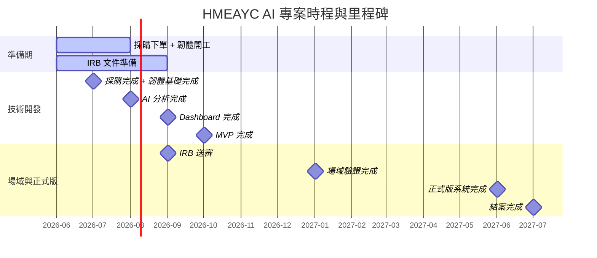

# 即時 AI 音樂學習工具之研發、實作與成效評估：支持幼兒整合性發展

> Real-time AI Music Learning Tool: Development, Implementation, and Evaluation for Promoting Early Childhood Integrated Development

本專案以 **HMEAYC（幼兒音樂與動作整合性發展）** 核心理論為基礎，採用 ESP32-C3 + MPU6050 IMU + Edge AI + Gemini 技術路線，由**朝陽科技大學**執行，計畫主持人為**李玲玉教授**。

---

## Monorepo 結構

```
HMEAYC/
├── web/                       # 課程介紹靜態網站 (vanilla HTML/CSS/JS)
├── backend/                   # 後端 AI Engine (FastAPI + PostgreSQL)
│   ├── app/
│   │   ├── api/               # REST & WebSocket endpoints
│   │   ├── analysis/          # 節奏分析 & Freeze Dance 演算法
│   │   ├── gemini/            # Gemini API 串接 & prompt 模板
│   │   ├── models/            # SQLAlchemy ORM
│   │   └── db/                # 資料庫連線
│   └── tests/
├── dashboard/                 # 前端視覺化面板 (React + Vite + TypeScript)
│   └── src/
│       ├── pages/             # LiveView, History, Report
│       ├── hooks/             # WebSocket 連線
│       └── api/               # REST client
├── firmware/                  # ESP32-C3 + MPU6050 韌體 (ESP-IDF)
│   └── main/
│       ├── imu_driver.c/h     # MPU6050 I2C 驅動
│       ├── wifi_manager.c/h   # WiFi 連線管理
│       └── websocket_client.c/h
├── hardware/                  # 硬體設計 (schematic, PCB layout, BOM)
│   ├── README.md
│   ├── schematic.md
│   └── pcb_layout.md
├── field-testing/             # 場域測試工具與數據記錄（預留）
├── docker-compose.yml         # 整合開發環境 (db + backend + dashboard)
├── Makefile                   # 常用指令快捷
└── .github/workflows/ci.yml   # CI/CD
```

## 快速開始

```bash
# 安裝後端依賴
make install-backend

# 安裝前端依賴
make install-dashboard

# 啟動完整開發環境 (Docker)
make dev

# 或分別啟動
make dev-backend    # http://localhost:8080
make dev-dashboard  # http://localhost:5173/dashboard/
```

---

## 📌 專案基本資料

| 項目 | 說明 |
| :--- | :--- |
| **計畫名稱** | 即時 AI 音樂學習工具之研發、實作與成效評估：支持幼兒整合性發展 |
| **執行單位** | 朝陽科技大學 (統一編號: 78951384) |
| **執行期間** | 2026/08/01 ～ 2027/07/31 |
| **計畫主持人** | 李玲玉教授 |
| **技術路線** | A方案 (ESP32-C3 + MPU6050 IMU + Edge AI + Gemini) |
| **核心理論** | HMEAYC (幼兒音樂與動作整合性發展理論) |
| **重要里程碑目標** | <ul><li>**2026年10月**：完成 MVP</li><li>**2026年11月**：進入場域測試</li><li>**2027年06月**：完成正式版系統</li><li>**2027年07月**：完成國科會結案</li></ul> |

---

## 🗓️ 專案月里程碑 (Milestones)



| 期間 | 里程碑目標 | 主責 |
| :--- | :--- | :--- |
| **2026/06～07** | 採購下單、韌體基礎完成（IMU讀值 + 傳輸） | 冠 |
| **2026/06～07** | IRB 文件起草、HMEAYC 指標確認 | Liza |
| **2026/08** | AI 分析完成（節奏 + Freeze Dance） | 亮 |
| **2026/09** | Dashboard 完成、IRB 正式送審 | 亮 / Liza |
| **2026/10** | MVP 完成 | 全員 |
| **2026/11～** | 場域驗證（IRB 核准後進場） | Liza 主導 |
| **2027/01** | 場域驗證完成 | Liza |
| **2027/02～05** | 正式版開發（場域回饋迭代） | 亮 / 冠 |
| **2027/06** | 正式版完成 | 全員 |
| **2027/07** | 結案 | Liza |

---

## 🎯 MVP 範圍 (MVP Scope)

* **IMU 資料收集**：即時感測幼兒肢體動作數據。
* **節奏分析**：偵測幼兒動作與音樂節奏的互動。
* **Freeze Dance 分析**：評估幼兒在音樂停止時的反應與身體控制。
* **Dashboard 視覺化面板**：提供教師及研究人員即時觀看分析結果。
* **Gemini 報告生成**：運用大型語言模型自動生成幼兒學習發展成效評估報告。

> [!IMPORTANT]
> **請勿於 10 月前新增其他功能，以確保 MVP 準時交付。**

---

## 👥 團隊與分工

| 成員 | 角色 | 主要負責範圍 |
| :--- | :--- | :--- |
| **李玲玉 (Liza)** | 計畫主持人 | HMEAYC 指標定義、IRB 主責、場域測試協定、教師培訓、論文主筆、驗收報告品質 |
| **陳亮 (亮)** | 軟體開發 | `backend/`（節奏 + Freeze Dance）、`backend/app/gemini/`（Gemini 報告）、`dashboard/`（前後端） |
| **陳冠 (冠)** | 硬體開發 | `firmware/`（ESP32-C3 + MPU6050）、WiFi 傳輸、硬體採購 |

**關鍵介面點：**
- 冠 ↔ 亮：IMU 傳輸協定格式 (WebSocket JSON)，需在 **07 月底前** 對齊
- 亮 ↔ Liza：HMEAYC 分析指標定義，需在 **08 月初前** 確認

---

## 🚀 近期執行任務

### IRB 倫理審查準備
> [!WARNING]
> **IRB 準備工作必須立即啟動！目標 9 月底送審，11～12 月取得核准。**
> 需準備文件：
> - 家長同意書 / 幼兒資料同意書 / 個資告知書 / 研究說明書

### 採購清單 (硬體)

| 項目 | 數量 | 用途 |
|------|------|------|
| ESP32-C3-MINI-1 模組 | 10 | 穿戴式感測器主控 |
| MPU6050 IMU 感測器 | 10 | 6 軸動作偵測 |
| TP4056 充電板 | 10 | 鋰電池充電 |
| ME6211 3.3V LDO | 10 | 穩壓 |
| LiPo 503040 500mAh | 10 | 電池 |
| USB-C 連接器 | 10 | 充電/資料 |
| Android 平板 | 2 | 場域施測 |
| WiFi 路由器 | 1 | 場域網路 |

---

## 💡 後續下一步

1. 硬體採購下單 → 打樣 PCB + 焊接測試
2. MPU6050 驅動整合測試（I2C scan + raw data log）
3. Backend analysis engine 實作（節奏分析 + Freeze Dance）
4. Dashboard UI 開發（即時圖表 + WebSocket 串接）
5. MVP 里程碑追蹤
