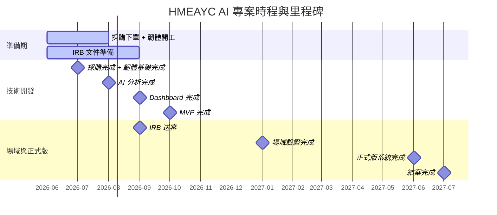

# 即時 AI 音樂學習工具之研發、實作與成效評估：支持幼兒整合性發展

> Real-time AI Music Learning Tool: Development, Implementation, and Evaluation for Promoting Early Childhood Integrated Development

本專案以 **HMEAYC（幼兒音樂與動作整合性發展）** 核心理論為基礎，採用 ESP32-C3 + MPU6500 IMU + Edge AI + Gemini 技術路線，由**朝陽科技大學**執行，計畫主持人為**李玲玉教授**。

---

## Monorepo 結構

```
HMEAYC/
├── web/                       # 課程介紹靜態網站 (vanilla HTML/CSS/JS)
├── backend/                   # 後端 AI Engine (FastAPI + PostgreSQL)
│   ├── app/
│   │   ├── __init__.py        # 套件入口 + 版本號
│   │   ├── __main__.py        # CLI entry point (python -m app)
│   │   ├── main.py            # FastAPI app + router 掛載
│   │   ├── cli.py             # 命令列參數解析
│   │   ├── paths.py           # 記憶/報告/暫存目錄路徑管理
│   │   ├── pipeline.py        # 完整影片分析管線
│   │   ├── timecode.py        # 時間碼解析與格式化
│   │   ├── viz.py             # 熱區圖 + 軌跡圖繪製 (matplotlib)
│   │   ├── api/               # REST & WebSocket endpoints
│   │   │   ├── __init__.py
│   │   │   ├── video_analysis.py  # 影片分析任務管理 API
│   │   │   ├── sessions.py    # Session CRUD + analysis/report
│   │   │   ├── reports.py     # Report 查詢
│   │   │   ├── firmware.py    # OTA 韌體管理
│   │   │   ├── devices.py     # 裝置/學員註冊 + 跨模態配對
│   │   │   └── ws.py          # WebSocket IMU 即時串流
│   │   ├── analysis/          # 巨觀/微觀分析 + 姿勢精化
│   │   │   ├── macro.py       # 群體隊形、熱區、參與度
│   │   │   ├── metrics.py     # 指標燈號與綜合評分
│   │   │   ├── micro.py       # 個體節奏同步/穩定度/流暢度
│   │   │   ├── rhythm.py      # IMU 節奏同步分析 (motion energy)
│   │   │   ├── freeze_dance.py# IMU Freeze Dance (反應時間 + 穩定度)
│   │   │   └── pose/          # MediaPipe Pose/Holistic 精化
│   │   │       ├── common.py
│   │   │       ├── estimator.py
│   │   │       └── holistic.py
│   │   ├── tracking/          # 身分辨識與跨影片累積
│   │   │   ├── identity.py    # 外觀嵌入比對 + 身分資料庫
│   │   │   ├── face_insight.py    # ArcFace stub
│   │   │   ├── longitudinal.py    # 跨影片 sessions.jsonl
│   │   │   └── importer.py    # 批次匯入既有 metrics
│   │   ├── report/            # 教育報告生成
│   │   │   ├── advisor.py     # 教育建議 Markdown 模板
│   │   │   ├── ai_edu.py      # OpenAI 相容 LLM 補充段落
│   │   │   ├── pdf.py         # Markdown→PDF (weasyprint)
│   │   │   └── student.py     # 個人長期趨勢報告
│   │   ├── ingest/            # 影片輸入處理
│   │   │   ├── video.py       # OpenCV 中繼資料 + librosa 音訊
│   │   │   └── segment.py     # ffmpeg 影片裁切
│   │   ├── gemini/            # Gemini API 串接 & prompt 模板
│   │   ├── models/            # SQLAlchemy ORM (Session, IMUData, Device, Child, ...)
│   │   └── db/                # 資料庫連線
│   └── tests/
├── dashboard/                 # 前端視覺化面板 (React + Vite + TypeScript)
│   └── src/
│       ├── pages/             # Landing, LiveView, History, Report, AssessmentIndicators, DeviceManagement
│       ├── hooks/             # useWebSocket, useLiveMetrics
│       └── api/               # REST client
├── firmware/                  # ESP32-C3 + MPU6500 韌體 (ESP-IDF)
│   └── main/
│       ├── imu_driver.c/h     # MPU6500 I2C 驅動
│       ├── wifi_manager.c/h   # WiFi 連線管理
│       └── websocket_client.c/h
├── hardware/                  # 硬體設計 (schematic, PCB layout, BOM)
│   ├── README.md
│   ├── schematic.md
│   └── pcb_layout.md
├── field-testing/             # 場域測試工具與數據記錄（預留）
├── docker-compose.yml         # 整合開發環境 (db + backend + dashboard)
├── Makefile                   # 常用指令快捷
└── .github/workflows/ci.yml   # CI/CD
```

## 快速開始

```bash
# 安裝後端依賴
make install-backend

# 安裝前端依賴
make install-dashboard

# 啟動完整開發環境 (Docker)
make dev

# 或分別啟動
make dev-backend    # http://localhost:8080
make dev-dashboard  # http://localhost:5173/dashboard/
```

---

## 📌 專案基本資料

| 項目 | 說明 |
| :--- | :--- |
| **計畫名稱** | 即時 AI 音樂學習工具之研發、實作與成效評估：支持幼兒整合性發展 |
| **執行單位** | 朝陽科技大學 (統一編號: 78951384) |
| **執行期間** | 2026/08/01 ～ 2027/07/31 |
| **計畫主持人** | 李玲玉教授 |
| **技術路線** | A方案 (ESP32-C3 + MPU6500 IMU + Edge AI + Gemini) |
| **核心理論** | HMEAYC (幼兒音樂與動作整合性發展理論) |
| **重要里程碑目標** | <ul><li>**2026年10月**：完成 MVP</li><li>**2026年11月**：進入場域測試</li><li>**2027年06月**：完成正式版系統</li><li>**2027年07月**：完成國科會結案</li></ul> |

---

## 🗓️ 專案月里程碑 (Milestones)



| 期間 | 里程碑目標 | 主責 |
| :--- | :--- | :--- |
| **2026/06～07** | 採購下單、韌體基礎完成（IMU讀值 + 傳輸） | Rover |
| **2026/06～07** | IRB 文件起草、HMEAYC 指標確認 | Liza |
| **2026/08** | AI 分析完成（節奏 + Freeze Dance） | Ychen |
| **2026/09** | Dashboard 完成、IRB 正式送審 | Ychen / Liza |
| **2026/10** | MVP 完成 | 全員 |
| **2026/11～** | 場域驗證（IRB 核准後進場） | Liza 主導 |
| **2027/01** | 場域驗證完成 | Liza |
| **2027/02～05** | 正式版開發（場域回饋迭代） | Ychen / Rover |
| **2027/06** | 正式版完成 | 全員 |
| **2027/07** | 結案 | Liza |

---

## 🎯 MVP 範圍 (MVP Scope)

* **IMU 資料收集**：即時感測幼兒肢體動作數據。
* **節奏分析**：偵測幼兒動作與音樂節奏的互動。
* **Freeze Dance 分析**：評估幼兒在音樂停止時的反應與身體控制。
* **Dashboard 視覺化面板**：提供教師及研究人員即時觀看分析結果。
* **Gemini 報告生成**：運用大型語言模型自動生成幼兒學習發展成效評估報告。

> [!IMPORTANT]
> **請勿於 10 月前新增其他功能，以確保 MVP 準時交付。**

---

## 👥 團隊與分工

| 成員 | 角色 | 主要負責範圍 |
| :--- | :--- | :--- |
| **李玲玉 (Liza)** | 計畫主持人 | HMEAYC 指標定義、IRB 主責、場域測試協定、教師培訓、論文主筆、驗收報告品質 |
| **陳育亮 (Ychen)** | 軟體開發 | `backend/`（節奏 + Freeze Dance）、`backend/app/gemini/`（Gemini 報告）、`dashboard/`（前後端） |
| **陳育冠 (Rover)** | 硬體開發 | `firmware/`（ESP32-C3 + MPU6500）、WiFi 傳輸、硬體採購 |

**關鍵介面點：**
- Rover ↔ Ychen：IMU 傳輸協定格式 (WebSocket JSON)，需在 **07 月底前** 對齊
- Ychen ↔ Liza：HMEAYC 分析指標定義，需在 **08 月初前** 確認

---

## 🚀 近期執行任務

### IRB 倫理審查準備
> [!WARNING]
> **IRB 準備工作必須立即啟動！目標 9 月底送審，11～12 月取得核准。**
> 需準備文件：
> - 家長同意書 / 幼兒資料同意書 / 個資告知書 / 研究說明書

### 採購清單 (硬體)

| 項目 | 數量 | 用途 |
|------|------|------|
| ESP32-C3-MINI-1 模組 | 10 | 穿戴式感測器主控 |
| MPU6500 IMU 感測器 | 10 | 6 軸動作偵測 |
| TP4056 充電板 | 10 | 鋰電池充電 |
| ME6211 3.3V LDO | 10 | 穩壓 |
| LiPo 503040 500mAh | 10 | 電池 |
| USB-C 連接器 | 10 | 充電/資料 |
| Android 平板 | 2 | 場域施測 |
| WiFi 路由器 | 1 | 場域網路 |

---

---

## 👥 多人系統裝置管理（Cross-Modal Device Assignment）

基於論文 *"A Cross-Modal Child Identification Framework for AI-Assisted Music Learning"* 設計，解決 N 個小孩戴 N 條腰帶時的自動配對問題。

### 核心架構

```
┌─────────────────────┐     ┌──────────────────────┐
│  ESP32-C3 腰帶 × N   │     │  天花板攝影機          │
│  IMU 50Hz WebSocket  │     │  MediaPipe Pose 30fps │
└────────┬────────────┘     └──────────┬───────────┘
         │                             │
         ▼                             ▼
┌──────────────────────────────────────────────┐
│              FastAPI 後端伺服器                  │
│                                                │
│  1. FFT 相位提取 @BPM 頻率                      │
│  2. N² 候選自校準演算法                          │
│  3. Hungarian 全域最優指派                       │
│  4. 信心分數計算 + 教師手動覆寫                   │
└──────────────────────┬───────────────────────┘
                       ▼
┌──────────────────────────────────────────────┐
│    Dashboard 裝置管理頁                        │
│   📡 裝置列表 / 👤 學員管理 / 🔗 配對機制       │
└──────────────────────────────────────────────┘
```

### API 端點

| Method | Path | 說明 |
|--------|------|------|
| `GET` | `/api/devices` | 列出所有註冊裝置（ESP32 腰帶） |
| `POST` | `/api/devices` | 註冊/更新裝置（ESP32 連線時自動呼叫） |
| `GET` | `/api/children` | 列出所有學員 |
| `POST` | `/api/children` | 註冊學員 |
| `GET` | `/api/sessions/{id}/assignments` | 查詢課程配對結果 |
| `POST` | `/api/sessions/{id}/assign` | 執行裝置-學員配對 |

### Dashboard 頁面

| 路徑 | 頁面 | 說明 |
|------|------|------|
| `/dashboard/devices` | 裝置管理 | 裝置列表（狀態/電量/韌體）、學員註冊、配對機制說明 |
| `/dashboard/assessment/default` | 評估指標 | 即時 IMU 指標運算（活動量/平穩度/穩定指數） |

### 資料庫模型

- **Device** — ESP32 腰帶註冊（device_id, name, firmware_version, battery_level, status）
- **Child** — 學員資料（name, student_id, notes）
- **DeviceAssignment** — 配對記錄（session_id, device_id, child_id, confidence, method）

---

## 💡 後續下一步

1. 硬體採購下單 → 打樣 PCB + 焊接測試
2. MPU6500 驅動整合測試（I2C scan + raw data log）
3. Backend analysis engine 實作（節奏分析 + Freeze Dance）
4. Dashboard UI 開發（即時圖表 + WebSocket 串接）
5. 跨模態配對演算法真實場域驗證（IRB 核准後）
6. MVP 里程碑追蹤
