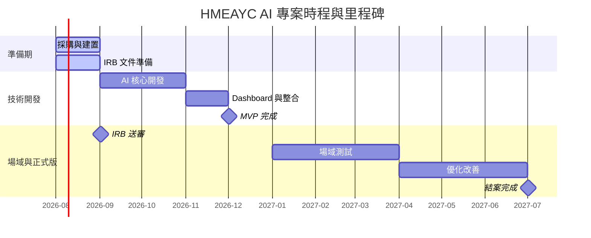

# 即時 AI 音樂學習工具之研發、實作與成效評估：支持幼兒整合性發展

> Real-time AI Music Learning Tool: Development, Implementation, and Evaluation for Promoting Early Childhood Integrated Development

本專案以 **HMEAYC（幼兒音樂與動作整合性發展）** 核心理論為基礎，採用 ESP32-C3 + MPU6500 IMU + Edge AI + Gemini 技術路線，由**朝陽科技大學**執行，計畫主持人為**李玲玉教授**。

---

## Monorepo 結構

```
├── dashboard/                 # 前端視覺化面板 (React + Vite + TypeScript)
├── backend/                   # 後端 AI Engine (FastAPI + PostgreSQL)
├── firmware/                  # ESP32-C3 + MPU6500 韌體 (ESP-IDF)
│   ├── main/ota_client.[ch]   # OTA 遠端韌體更新 (版本檢查/下載/ack)
│   ├── main/device_registry.[ch]  # 裝置註冊
│   ├── main/wifi_config_nvs.[ch]  # 遠端 WiFi 設定管理
│   ├── main/session_config_nvs.[ch]  # 遠端 Session 指派查詢（動態 WS 連線）
│   └── main/battery.[ch]          # 電池電量讀取
├── hardware/                  # 硬體設計 (schematic, PCB layout, BOM)
├── field-testing/             # 場域測試工具與數據記錄
├── deploy/                    # 部署腳本
├── .opencode/                 # opencode 組態與開發計畫（含架構規劃）
├── .dockerignore
├── .gitignore
├── Makefile                   # 常用指令快捷
├── docker-compose.yml         # 整合開發環境 (db + backend + dashboard)
├── start.sh / stop.sh         # 背景啟動/停止全部服務
└── OPERATION.md               # 完整操作手冊
```

## 快速開始

```bash
# 安裝後端依賴
make install-backend

# 安裝前端依賴
make install-dashboard

# 快速背景啟動全部服務
make start            # PostgreSQL + Backend(:8080) + Dashboard(:5173)
# 停止
make stop

# 或分別啟動（前景，推薦開發除錯用）
make dev              # docker compose
make dev-backend      # Terminal 1 — http://localhost:8080
make dev-dashboard    # Terminal 2 — http://localhost:5173/dashboard/
```

---

## 📌 專案基本資料

| 項目 | 說明 |
| :--- | :--- |
| **計畫名稱** | 即時 AI 音樂學習工具之研發、實作與成效評估：支持幼兒整合性發展 |
| **執行單位** | 朝陽科技大學 (統一編號: 78951384) |
| **執行期間** | 2026/08/01 ～ 2027/07/31 |
| **計畫主持人** | 李玲玉教授 |
| **技術路線** | A方案 (ESP32-C3 + MPU6500 IMU + Edge AI + Gemini) |
| **核心理論** | HMEAYC (幼兒音樂與動作整合性發展理論) |
| **重要里程碑目標** | <ul><li>**2026年12月**：完成 MVP</li><li>**2027年01～03月**：進入場域測試</li><li>**2027年04～06月**：優化改善（正式版開發）</li><li>**2027年07月**：完成國科會結案</li></ul> |

---

## 🗓️ 專案月里程碑 (Milestones)



| 期間 | 里程碑目標 | 主責 |
| :--- | :--- | :--- |
| **2026/08** | 採購下單、韌體基礎完成（IMU讀值 + 傳輸） | Rover |
| **2026/08～09** | IRB 文件起草、HMEAYC 指標確認、IRB 正式送審 | Liza |
| **2026/09～10** | AI 分析完成（節奏 + Freeze Dance） | Ychen |
| **2026/11** | Dashboard 與整合完成 | Ychen / Liza |
| **2026/12** | MVP 完成 | 全員 |
| **2027/01～03** | 場域測試（IRB 核准後進場） | Liza 主導 |
| **2027/04～06** | 優化改善（場域回饋迭代） | Ychen / Rover |
| **2027/07** | 結案 | Liza |

---

## 🎯 MVP 範圍 (MVP Scope)

* **IMU 資料收集**：即時感測幼兒肢體動作數據。
* **節奏分析**：偵測幼兒動作與音樂節奏的互動（支援即時 BPM 對齊）。
* **Freeze Dance 分析**：評估幼兒在音樂停止時的反應與身體控制（即時停止信號偵測）。
* **即時音樂源整合**：教師上傳音樂檔 → 後端預分析 BPM/beat/stop times → WebSocket 廣播 → IMU 即時對齊。
* **Dashboard 視覺化面板**：提供教師及研究人員即時觀看分析結果 + 節拍指示器。
* **Gemini 報告生成**：運用大型語言模型自動生成幼兒學習發展成效評估報告。

> [!IMPORTANT]
> **請勿於 12 月前新增其他功能，以確保 MVP 準時交付。**

---

## 👥 團隊與分工

| 成員 | 角色 | 主要負責範圍 |
| :--- | :--- | :--- |
| **李玲玉 (Liza)** | 計畫主持人 | HMEAYC 指標定義、IRB 主責、場域測試協定、教師培訓、論文主筆、驗收報告品質 |
| **陳育亮 (Ychen)** | 軟體開發 | `backend/`（節奏 + Freeze Dance）、`backend/app/gemini/`（Gemini 報告）、`dashboard/`（前後端） |
| **陳育冠 (Rover)** | 硬體開發 | `firmware/`（ESP32-C3 + MPU6500）、WiFi 傳輸、硬體採購 |

**關鍵介面點：**
- Rover ↔ Ychen：IMU 傳輸協定格式 (WebSocket JSON)，需在 **07 月底前** 對齊
- Ychen ↔ Liza：HMEAYC 分析指標定義，需在 **08 月初前** 確認

---

## 🚀 近期執行任務

### IRB 倫理審查準備
> [!WARNING]
> **IRB 準備工作必須立即啟動！目標 9 月底送審，11～12 月取得核准。**
> 需準備文件：
> - 家長同意書 / 幼兒資料同意書 / 個資告知書 / 研究說明書

### 採購清單 (硬體)

| 項目 | 數量 | 用途 |
|------|------|------|
| ESP32-C3-MINI-1 模組 | 10 | 穿戴式感測器主控 |
| MPU6500 IMU 感測器 | 10 | 6 軸動作偵測 |
| ME6211 3.3V LDO | 10 | 穩壓 |
| 16500 Li-ion 電池 (800mAh) | 10 | 外部電源 |
| 16500 電池盒 (含 JST 2.0 線) | 10 | 電池座 |
| USB-C 連接器 | 10 | 程式燒錄 |
| Android 平板 | 2 | 場域施測 |
| WiFi 路由器 | 1 | 場域網路 |

---

---

## 👥 多人系統裝置管理（Cross-Modal Device Assignment）

基於論文 *"A Cross-Modal Child Identification Framework for AI-Assisted Music Learning"* 設計，解決 N 個小孩戴 N 條腰帶時的自動配對問題。

### 核心架構

```
┌─────────────────────┐     ┌──────────────────────┐
│  ESP32-C3 腰帶 × N   │     │  天花板攝影機          │
│  IMU 50Hz WebSocket  │     │  MediaPipe Pose 30fps │
└────────┬────────────┘     └──────────┬───────────┘
         │                             │
         ▼                             ▼
┌──────────────────────────────────────────────┐
│              FastAPI 後端伺服器                  │
│                                                │
│  1. FFT 相位提取 @BPM 頻率                      │
│  2. N² 候選自校準演算法                          │
│  3. Hungarian 全域最優指派                       │
│  4. 信心分數計算 + 教師手動覆寫                   │
└──────────────────────┬───────────────────────┘
                       ▼
┌──────────────────────────────────────────────┐
│    Dashboard 裝置管理頁                        │
│   📡 裝置列表 / 👤 學員管理 / 🔗 配對機制       │
└──────────────────────────────────────────────┘
```

### API 端點

| Method | Path | 說明 |
|--------|------|------|
| `GET` | `/api/devices` | 列出所有註冊裝置（ESP32 腰帶） |
| `POST` | `/api/devices` | 註冊/更新裝置（ESP32 連線時自動呼叫） |
| `GET` | `/api/children` | 列出所有學員 |
| `POST` | `/api/children` | 註冊學員 |
| `GET` | `/api/sessions/{id}/assignments` | 查詢課程配對結果 |
| `POST` | `/api/sessions/{id}/assign` | 執行裝置-學員配對 |

### Dashboard 頁面

| 路徑 | 頁面 | 說明 |
|------|------|------|
| `/dashboard/templates` | 教案模板 | 建立可重複使用的課程階段模板 |
| `/dashboard/sessions` | 課程管理 | 排程、開課、管理課程生命週期 |
| `/dashboard/sessions/:id` | 課程詳情 | 檢視課程階段、評估、開始/結束課程 |
| `/dashboard/sessions/:id/report` | 課程報告 | 課程完整 AI 分析報告 |
| `/dashboard/live/:sessionId` | 即時監控 | 即時 IMU 6 軸圖表 |
| `/dashboard/history` | 課程紀錄 | Session 列表 |
| `/dashboard/devices` | 裝置管理 | ESP32 穿戴式裝置列表（狀態/電量/韌體/WiFi） |
| `/dashboard/assessment/default` | 評估指標 | 即時 IMU 指標運算（活動量/平穩度/穩定指數） |

### 資料庫模型

- **Device** — ESP32 腰帶註冊（device_id, name, firmware_version, battery_level, status, active_session_id）
- **Child** — 學員資料（name, student_id, notes）
- **DeviceAssignment** — 配對記錄（session_id, device_id, child_id, confidence, method）

---

## 🔄 OTA 遠端韌體更新

ESP32 透過 AB 分割區支援 OTA，不須 USB 即可更新韌體。

### 流程

1. **建置新版韌體**：`cd firmware && idf.py build`
2. **上傳至後端**：Dashboard「韌體更新」頁面或 `curl -X POST /api/firmware/upload`
3. **ESP32 自動更新**：每小時檢查一次，下載新版 → 寫入 ota_1 → 重啟 → 回報 ack

### API 端點

| 方法 | 路徑 | 說明 |
|------|------|------|
| GET | `/api/firmware/version?current=X` | 版本檢查 |
| POST | `/api/firmware/upload` | 上傳韌體 binary（multipart） |
| GET | `/api/firmware/download/{id}` | 下載韌體 binary |
| GET | `/api/firmware/list` | 列出所有版本 |
| POST | `/api/firmware/ack` | 裝置確認啟動成功 |

---

## 💡 後續下一步

| # | 項目 | 狀態 | 說明 |
|---|------|------|------|
| 1 | 即時音樂源整合實作 | ✅ **已完成** | Session 綁定音樂檔 + BPM 分析 + WebSocket 廣播 + CD 曲目連結 + 即時節拍同步 |
| 2 | 硬體採購下單 → 打樣 PCB + 焊接測試 | ⏳ 待 Rover | ESP32-C3 + MPU6500 腰帶硬體 |
| 3 | 場域測試（IRB 核准後進場） | ⏳ 待 Liza | IRB 送審 → 核准後進場 |
| 4 | 跨模態配對演算法真實場域驗證 | ⏳ 待場域測試 | 需真實場域數據 |
| 5 | 正式版系統迭代（場域回饋整合） | ⏳ 待場域測試 | 場域回饋後迭代 |
| 6 | MVP 里程碑追蹤 | 📋 進行中 | 2026/12 目標完成 |

---

## 🔐 多租戶 RBAC 系統（已實作）

此專案已實作完整多租戶角色權限架構，支援多幼兒園/多班/多教師/多家長同時使用：

| 角色 | 權限範圍 |
|------|---------|
| **super_admin** | 全域管理，可檢視/管理所有組織 |
| **org_admin** | 管理所屬組織的教師/班級/裝置/幼兒 |
| **teacher** | 開課、查看所屬班級幼兒報告與指標 |
| **parent** | 唯讀檢視自己綁定幼兒的報告與發展歷程 |

### 認證方式

- **JWT Token** — Dashboard 使用者透過 `POST /api/auth/login` 取得 Bearer token
- **API Key** — ESP32 裝置與影片分析後台仍使用傳統 X-API-Key

### 新增 API

| Method | Path | 說明 |
|--------|------|------|
| `POST` | `/api/auth/login` | 登入取得 JWT |
| `GET` | `/api/auth/me` | 當前使用者資訊 |
| `GET` | `/api/admin/orgs` | 組織列表（super_admin） |
| `GET` | `/api/orgs/{orgId}/classes` | 班級列表 |
| `POST` | `/api/children/{childId}/parents` | 綁定家長 |
| `GET` | `/api/parents/me/children` | 家長查看幼兒 |
| `POST` | `/api/consent` | 上傳家長同意書 |
| `GET` | `/api/admin/export/anonymized` | 匿名化資料匯出 |

> 📋 詳細架構與實作記錄請見 [`.opencode/plans/multi-tenant-rbac.md`](.opencode/plans/multi-tenant-rbac.md)
