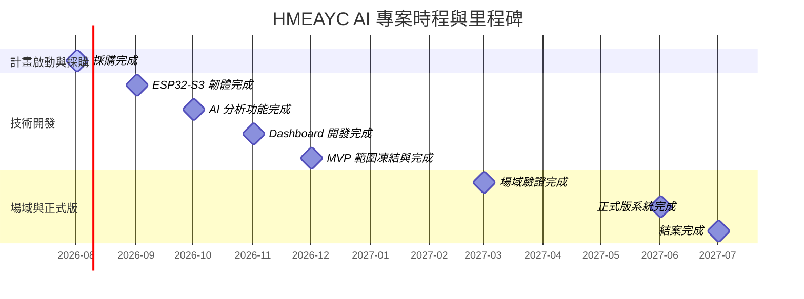
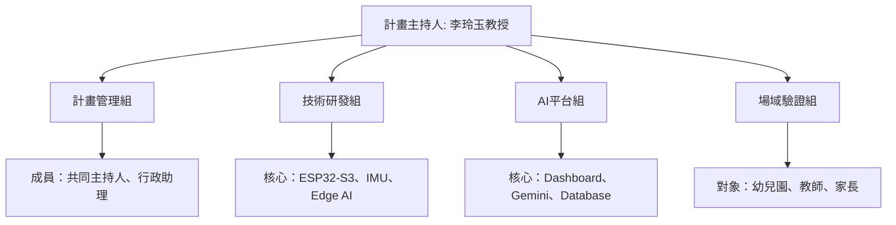

# 即時 AI 音樂學習工具之研發、實作與成效評估：支持幼兒整合性發展
> Real-time AI Music Learning Tool: Development, Implementation, and Evaluation for Promoting Early Childhood Integrated Development

本專案旨在研發並實作一套即時 AI 音樂學習工具，採用 A 方案技術路線（ESP32-S3 + IMU + Edge AI + Gemini），以 **HMEAYC（幼兒音樂與動作整合性發展）** 核心理論為基礎，旨在支持幼兒的整合性發展。本專案由**朝陽科技大學**執行，計畫主持人為**李玲玉教授**。

---

## 📌 專案基本資料

| 項目 | 說明 |
| :--- | :--- |
| **計畫名稱** | 即時 AI 音樂學習工具之研發、實作與成效評估：支持幼兒整合性發展 |
| **執行單位** | 朝陽科技大學 (統一編號: 78951384) |
| **執行期間** | 2026/08/01 ～ 2027/07/31 |
| **計畫主持人** | 李玲玉教授 |
| **技術路線** | A方案 (ESP32-S3 + IMU + Edge AI + Gemini) |
| **核心理論** | HMEAYC (幼兒音樂與動作整合性發展理論) |
| **重要里程碑目標** | <ul><li>**2026年12月**：完成 MVP 並進入場域測試</li><li>**2027年06月**：完成正式版系統</li><li>**2027年07月**：完成國科會結案</li></ul> |

---

## 🗓️ 專案月里程碑 (Milestones)



| 期間 | 里程碑目標 |
| :--- | :--- |
| **2026/08** | 採購完成 |
| **2026/09** | ESP32-S3 韌體完成 |
| **2026/10** | AI 分析完成 |
| **2026/11** | Dashboard 完成 |
| **2026/12** | MVP 完成 |
| **2027/03** | 場域驗證完成 |
| **2027/06** | 正式版完成 |
| **2027/07** | 結案完成 |

---

## 🎯 MVP 範圍 (MVP Scope)
為確保 2026 年 12 月能順利進入場域測試，MVP 範圍已凍結，僅包含以下核心功能：

* **IMU 資料收集**：即時感測幼兒肢體動作數據。
* **節奏分析**：偵測幼兒動作與音樂節奏的互動。
* **Freeze Dance 分析**：評估幼兒在音樂停止時的反應與身體控制。
* **Dashboard 視覺化面板**：提供教師及研究人員即時觀看分析結果。
* **Gemini 報告生成**：運用大型語言模型自動生成幼兒學習發展成效評估報告。

> [!IMPORTANT]
> **請勿於 12 月前新增其他功能，以確保 MVP 準時交付。**

---

## 🚀 本週即刻執行任務 (Weekly Action Items)

### 1. 建立專案組織架構
為使計畫順利運作，建議立即成立以下四個工作小組：



* **計畫管理組**：計畫主持人、共同主持人、行政助理
* **技術研發組**：ESP32-S3、IMU、Edge AI
* **AI 平台組**：Dashboard、Gemini、Database
* **場域驗證組**：幼兒園、教師、家長

### 2. 建立 GitHub Organization & Repositories
建議組織名稱：`CYUT-HMEAYC-AI`
請建立以下七個 Repositories，以進行程式碼與文件管理：

* `firmware-esp32s3`：ESP32-S3 晶片韌體開發
* `dashboard`：前端數據視覺化平台
* `ai-engine`：Edge AI 與 Gemini 串接模組
* `field-testing`：場域測試工具與數據記錄
* `documents`：計畫相關行政與規格文件
* `patents`：專利申請相關文件與紀錄
* `papers`：學術論文撰寫與參考文獻

### 3. 建立雲端協作空間 (Google Drive)
建議目錄架構設計如下：
```text
Google Drive (根目錄)
├── 01_計畫管理
├── 02_會議紀錄
├── 03_IRB
├── 04_採購
├── 05_技術文件
├── 06_場域測試
├── 07_論文
├── 08_專利
└── 09_結案
```

### 4. 8 月採購清單初稿規劃
為確保硬體研發進度，本週需確認並啟動以下採購流程：

* **開發設備**：
  - ESP32-S3 開發板 × 10
  - BMI270 IMU 感測器 × 10
  - 鋰電池 × 10
  - 充電板 × 10
* **測試設備**：
  - Android 平板 × 2 (場域施測與數據查看用)
  - WiFi 路由器 (WiFi Router) × 1 (場域網段環境建立)
* **雲端與軟體服務**：
  - Gemini API (AI 報告生成)
  - GitHub Team 訂閱

### 5. IRB 倫理審查準備
> [!WARNING]
> **IRB (人類研究倫理審查) 準備工作必須於 8 月立即啟動！**
> 若未於 8 月開始準備，將導致 2027 年 1 月的場域測試因審查未通過而延宕。
> 本週需開始撰寫與準備以下文件：
> * 家長同意書
> * 幼兒資料同意書
> * 個資告知書
> * 研究說明書

---

## 💡 後續下一步建議 (Next Step)

建議本週完成上述基礎建設後，直接開始撰寫 **《文件01 年度總執行計畫書完整版（約20頁）》**。
這份文件將作為本計畫的 **專案章程 (Project Charter)**，後續其餘四份子計畫文件都將由此母文件衍生，以確保整體計畫的邏輯與內容完全一致，避免版本與資訊衝突。
